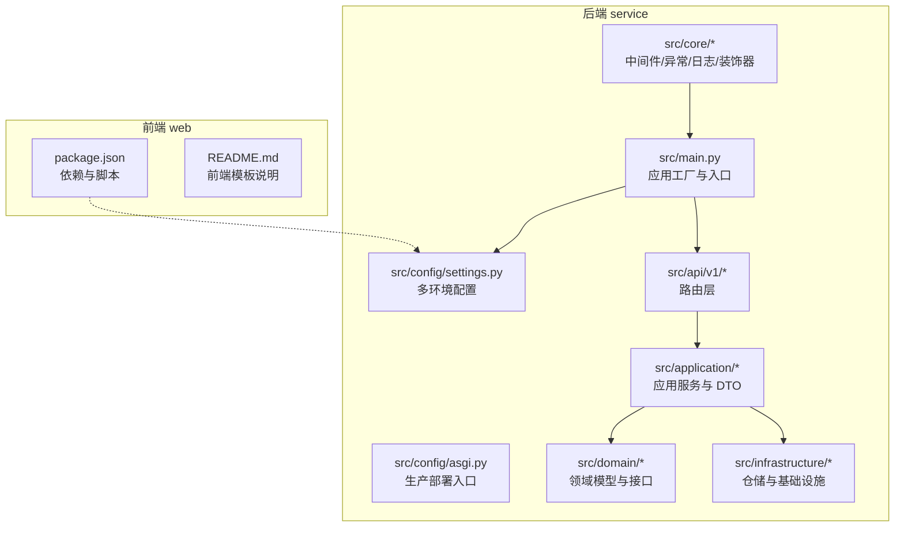
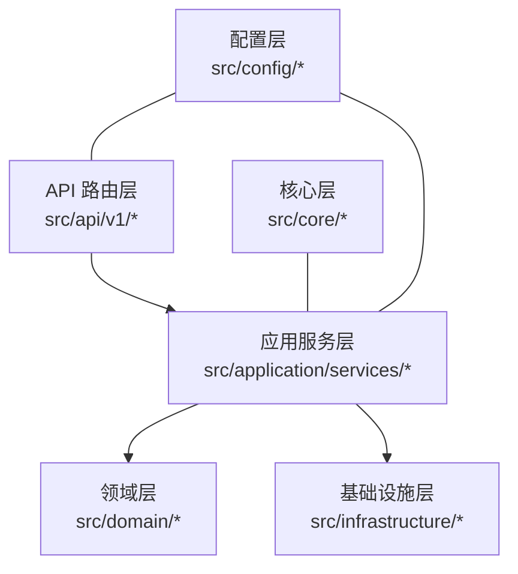
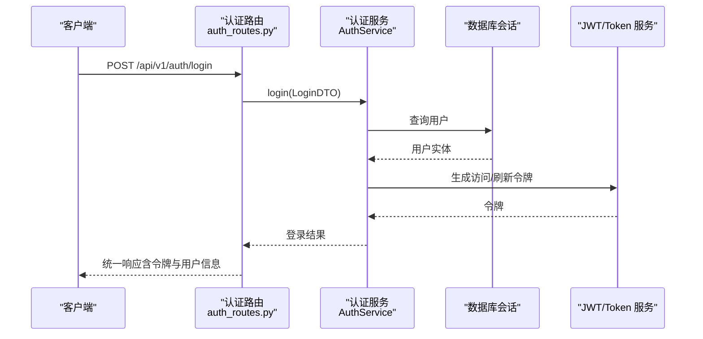
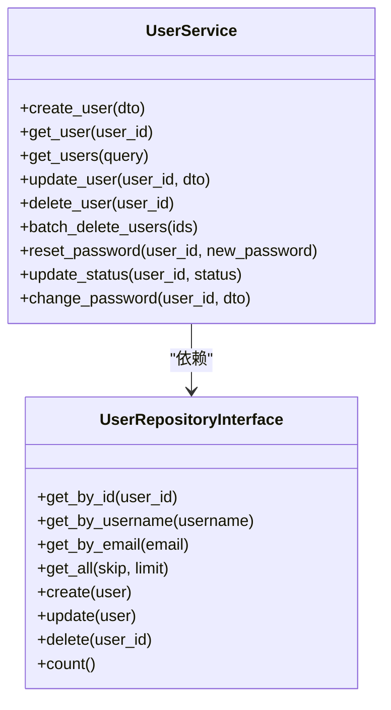
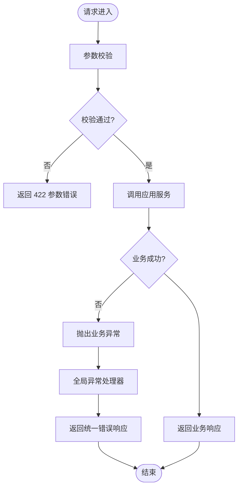
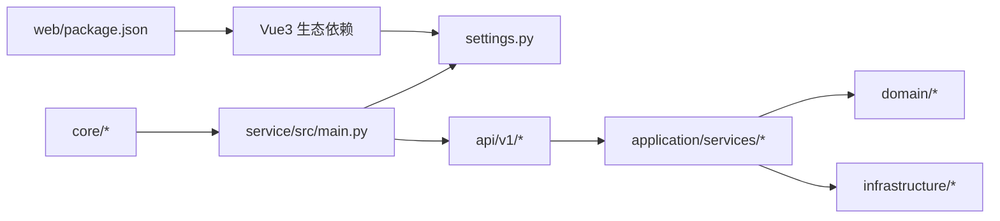

# 项目介绍

<cite>
**本文引用的文件**
- [service/README.md](file://service/README.md)
- [web/README.md](file://web/README.md)
- [service/pyproject.toml](file://service/pyproject.toml)
- [web/package.json](file://web/package.json)
- [service/src/main.py](file://service/src/main.py)
- [service/src/config/settings.py](file://service/src/config/settings.py)
- [service/src/config/asgi.py](file://service/src/config/asgi.py)
- [service/src/domain/user/repository.py](file://service/src/domain/user/repository.py)
- [service/src/application/services/user_service.py](file://service/src/application/services/user_service.py)
- [service/src/api/v1/auth_routes.py](file://service/src/api/v1/auth_routes.py)
- [service/src/core/logger.py](file://service/src/core/logger.py)
- [service/src/core/decorators.py](file://service/src/core/decorators.py)
</cite>

## 目录
1. [引言](#引言)
2. [项目结构](#项目结构)
3. [核心组件](#核心组件)
4. [架构总览](#架构总览)
5. [详细组件分析](#详细组件分析)
6. [依赖关系分析](#依赖关系分析)
7. [性能考量](#性能考量)
8. [故障排查指南](#故障排查指南)
9. [结论](#结论)
10. [附录](#附录)

## 引言
Hello-FastApi 是一个基于 FastAPI 的企业级 RESTful API 服务，采用领域驱动设计（DDD）分层架构与 RBAC 权限控制，结合 JWT 认证、异步处理与类型安全，为企业级中后台系统提供高内聚、低耦合、可扩展的后端能力。项目同时包含前端 Vue3 管理系统模板，便于快速搭建“前后端一体化”的中后台原型与生产系统。

- 核心价值主张
  - 以 DDD 分层解耦业务与技术实现，提升可维护性与可演进性
  - 内置 RBAC 权限体系，支持角色与权限精细化管理
  - 现代化认证方案（JWT），配合刷新令牌与安全策略
  - 全面异步化（async/await），提升高并发场景吞吐
  - 类型安全与 Pydantic 数据校验，降低运行期风险
  - 模块化设计与清晰目录结构，便于团队协作与二次开发

- 目标用户群体
  - 中大型企业 IT 团队与 SaaS 团队
  - 需要快速落地中后台系统的项目团队
  - 对安全性、可维护性、可观测性有较高要求的团队

- 应用场景
  - 企业中后台管理系统（用户/角色/菜单/权限）
  - 多租户/部门化组织管理
  - 需要高并发、可观测、可扩展的 API 服务

- 开源协议与社区
  - 后端服务：MIT 许可证
  - 前端模板：MIT 许可证
  - 社区活跃，提供文档、脚手架与持续更新

**章节来源**
- [service/README.md:1-259](file://service/README.md#L1-L259)
- [web/README.md:1-239](file://web/README.md#L1-L239)

## 项目结构
项目采用“前后端分离 + 一体化仓库”的组织方式：
- service：后端 FastAPI 服务，遵循 DDD 分层（api/application/domain/infrastructure/core/config）
- web：前端 Vue3 管理系统模板，提供丰富的 UI 组件与页面
- docs：设计与 API 文档
- docker：Docker 与编排配置
- scripts：开发与运维脚本（如 CLI、API 校验、环境初始化）

**图表来源**
- [service/src/main.py:1-96](file://service/src/main.py#L1-L96)
- [service/src/config/settings.py:1-198](file://service/src/config/settings.py#L1-L198)
- [service/src/config/asgi.py:1-6](file://service/src/config/asgi.py#L1-L6)
- [web/package.json:1-210](file://web/package.json#L1-L210)

**章节来源**
- [service/README.md:27-93](file://service/README.md#L27-L93)
- [service/src/main.py:34-96](file://service/src/main.py#L34-L96)
- [service/src/config/settings.py:41-198](file://service/src/config/settings.py#L41-L198)

## 核心组件
- 应用工厂与生命周期
  - 应用工厂负责创建 FastAPI 实例、注册中间件、异常处理、健康检查与路由
  - 生命周期管理器在启动时初始化数据库，在关闭时释放连接
- 配置系统
  - 多环境配置（development/production/testing），支持 .env.* 文件与系统环境变量
  - 统一读取与校验（如日志级别、CORS、JWT、Redis、数据库等）
- 日志与监控
  - 基于 loguru 的统一日志，支持控制台、文件轮转、访问日志与错误日志分离
- 路由与认证
  - 认证路由提供登录、注册、刷新、登出接口
  - 依赖注入数据库会话与当前用户上下文
- 应用服务与领域
  - 用户服务封装业务逻辑（创建、查询、更新、删除、密码变更等）
  - 领域仓库接口定义用户 CRUD 操作契约
- 基础设施
  - 数据库连接与模型（SQLite/PostgreSQL），仓储实现
  - 缓存（Redis）与加密（bcrypt）、JWT（python-jose）

**章节来源**
- [service/src/main.py:19-96](file://service/src/main.py#L19-L96)
- [service/src/config/settings.py:41-198](file://service/src/config/settings.py#L41-L198)
- [service/src/core/logger.py:1-117](file://service/src/core/logger.py#L1-L117)
- [service/src/api/v1/auth_routes.py:1-86](file://service/src/api/v1/auth_routes.py#L1-L86)
- [service/src/application/services/user_service.py:1-322](file://service/src/application/services/user_service.py#L1-L322)
- [service/src/domain/user/repository.py:1-50](file://service/src/domain/user/repository.py#L1-L50)

## 架构总览
整体采用 DDD 分层架构，强调“业务驱动、技术解耦”：
- 表现层（API）：路由与依赖注入
- 应用层（Application）：应用服务编排业务流程
- 领域层（Domain）：领域模型与接口（如 UserRepositoryInterface）
- 基础设施层（Infrastructure）：仓储与外部系统（数据库、缓存、加密、JWT）
- 核心层（Core）：中间件、异常、日志、装饰器等横切关注点
- 配置层（Config）：多环境配置与 ASGI 入口

**图表来源**
- [service/src/api/v1/auth_routes.py:1-86](file://service/src/api/v1/auth_routes.py#L1-L86)
- [service/src/application/services/user_service.py:1-322](file://service/src/application/services/user_service.py#L1-L322)
- [service/src/domain/user/repository.py:1-50](file://service/src/domain/user/repository.py#L1-L50)
- [service/src/infrastructure/__init__.py:1-2](file://service/src/infrastructure/__init__.py#L1-L2)
- [service/src/core/__init__.py:1-2](file://service/src/core/__init__.py#L1-L2)
- [service/src/config/__init__.py:1-2](file://service/src/config/__init__.py#L1-L2)

## 详细组件分析

### 认证与授权（RBAC + JWT）
- 路由层提供登录、注册、刷新、登出接口，统一返回格式
- 应用服务负责业务编排（如密码哈希、令牌签发与刷新）
- JWT 配置包含密钥、算法、有效期等
- 基于角色的权限控制贯穿用户服务的响应 DTO，返回用户的角色与权限集合

**图表来源**
- [service/src/api/v1/auth_routes.py:19-34](file://service/src/api/v1/auth_routes.py#L19-L34)
- [service/src/application/services/user_service.py:25-58](file://service/src/application/services/user_service.py#L25-L58)

**章节来源**
- [service/src/api/v1/auth_routes.py:1-86](file://service/src/api/v1/auth_routes.py#L1-L86)
- [service/src/application/services/user_service.py:25-58](file://service/src/application/services/user_service.py#L25-L58)
- [service/src/config/settings.py:63-67](file://service/src/config/settings.py#L63-L67)

### 用户管理（应用服务与仓储）
- 用户服务提供创建、查询、更新、删除、批量删除、重置密码、状态变更、密码修改等能力
- 仓储接口定义用户 CRUD 与统计方法，便于替换实现（内存/数据库/缓存）
- 服务层进行数据一致性与业务规则校验（如唯一性、权限与状态）

**图表来源**
- [service/src/domain/user/repository.py:8-50](file://service/src/domain/user/repository.py#L8-L50)
- [service/src/application/services/user_service.py:18-322](file://service/src/application/services/user_service.py#L18-L322)

**章节来源**
- [service/src/domain/user/repository.py:1-50](file://service/src/domain/user/repository.py#L1-L50)
- [service/src/application/services/user_service.py:1-322](file://service/src/application/services/user_service.py#L1-L322)

### 日志与异常处理
- 统一日志：控制台彩色输出、应用日志文件、错误日志文件、访问日志（HTTP 请求）
- 异常处理：全局捕获业务异常、参数校验异常与未处理异常，返回统一结构
- 装饰器：提供函数执行时间记录等横切能力

**图表来源**
- [service/src/main.py:60-82](file://service/src/main.py#L60-L82)
- [service/src/core/logger.py:75-114](file://service/src/core/logger.py#L75-L114)
- [service/src/core/decorators.py:9-24](file://service/src/core/decorators.py#L9-L24)

**章节来源**
- [service/src/main.py:60-82](file://service/src/main.py#L60-L82)
- [service/src/core/logger.py:1-117](file://service/src/core/logger.py#L1-L117)
- [service/src/core/decorators.py:1-24](file://service/src/core/decorators.py#L1-L24)

### 配置与部署
- 多环境配置：development/production/testing，支持 .env.* 与系统环境变量
- ASGI 入口：生产环境使用 asgi.py 导出 application
- 部署建议：Docker Compose 或 Gunicorn + Nginx

**章节来源**
- [service/src/config/settings.py:144-198](file://service/src/config/settings.py#L144-L198)
- [service/src/config/asgi.py:1-6](file://service/src/config/asgi.py#L1-L6)
- [service/README.md:240-255](file://service/README.md#L240-L255)

## 依赖关系分析
- 后端依赖
  - Web 框架：FastAPI + Uvicorn
  - ORM：SQLModel + AsyncIO（aiosqlite/asyncpg）
  - 认证：python-jose + bcrypt
  - 缓存：Redis
  - 日志：loguru
  - 校验：Pydantic
- 前端依赖
  - Vue3 + Vite + Element Plus + TypeScript + Pinia + TailwindCSS
  - 丰富 UI 组件与页面模块，适合快速搭建中后台

**图表来源**
- [service/src/main.py:1-96](file://service/src/main.py#L1-L96)
- [service/src/config/settings.py:1-198](file://service/src/config/settings.py#L1-L198)
- [web/package.json:49-114](file://web/package.json#L49-L114)

**章节来源**
- [service/pyproject.toml:1-76](file://service/pyproject.toml#L1-L76)
- [web/package.json:1-210](file://web/package.json#L1-L210)

## 性能考量
- 异步化：全链路 async/await，充分利用事件循环与非阻塞 I/O
- 连接池与会话：数据库使用 AsyncSession，减少连接开销
- 缓存：Redis 用于热点数据与令牌存储，降低数据库压力
- 日志分级：生产环境降低日志级别，减少 IO 压力
- 部署建议：生产使用 Gunicorn + Uvicorn Worker，合理设置 worker 数量与并发

[本节为通用指导，无需特定文件引用]

## 故障排查指南
- 常见问题
  - 参数校验失败：检查 DTO 字段与请求体格式，查看 422 错误详情
  - 未处理异常：查看统一异常处理器返回的 500 错误与日志
  - 认证失败：确认 JWT 密钥、算法与过期时间配置
  - 数据库连接：检查 DATABASE_URL 与驱动（aiosqlite/asyncpg）
- 日志定位
  - 应用日志：logs/app.log
  - 错误日志：logs/error.log
  - 访问日志：logs/access.log
- 建议流程
  - 开启 DEBUG 并观察控制台输出
  - 查看访问日志定位请求耗时与状态码
  - 捕获异常堆栈，结合错误日志定位根因

**章节来源**
- [service/src/main.py:60-82](file://service/src/main.py#L60-L82)
- [service/src/core/logger.py:32-72](file://service/src/core/logger.py#L32-L72)

## 结论
Hello-FastApi 将现代 Web 技术与企业级需求相结合，通过 DDD 分层、RBAC 权限、JWT 认证、异步处理与类型安全，构建出高内聚、可扩展、易维护的后端骨架。配合前端 Vue3 管理模板，可快速落地中后台系统，满足企业对安全性、性能与可演进性的综合要求。

[本节为总结，无需特定文件引用]

## 附录
- 快速开始
  - 后端：安装依赖、配置环境、运行 CLI 启动服务
  - 前端：安装依赖、启动开发服务器、访问管理界面
- API 文档
  - Swagger：/api/docs
  - ReDoc：/api/redoc
- 许可证
  - 后端 MIT
  - 前端 MIT

**章节来源**
- [service/README.md:95-188](file://service/README.md#L95-L188)
- [service/README.md:137-139](file://service/README.md#L137-L139)
- [web/README.md:79-132](file://web/README.md#L79-L132)