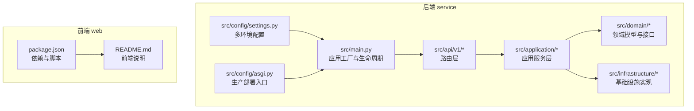
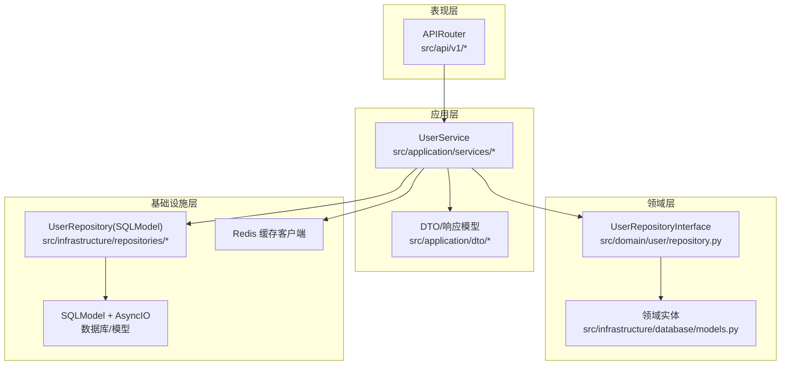
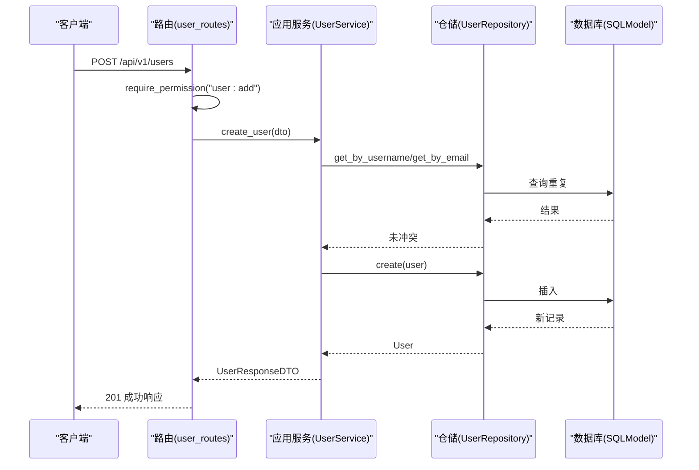
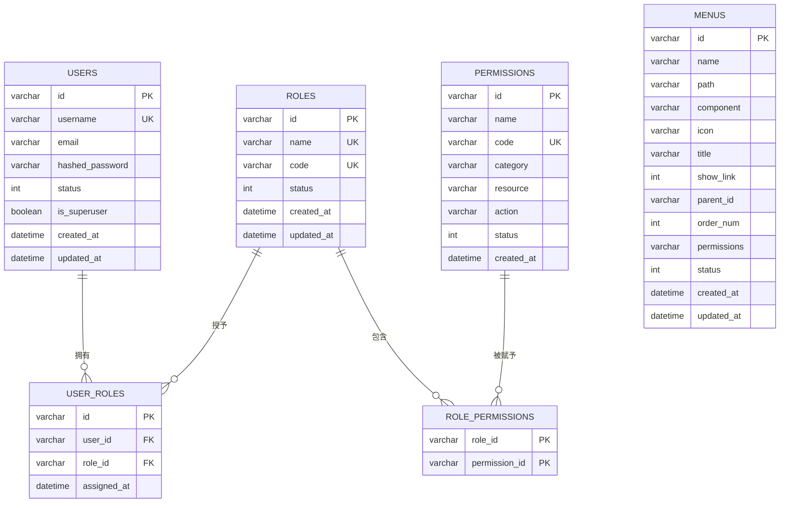
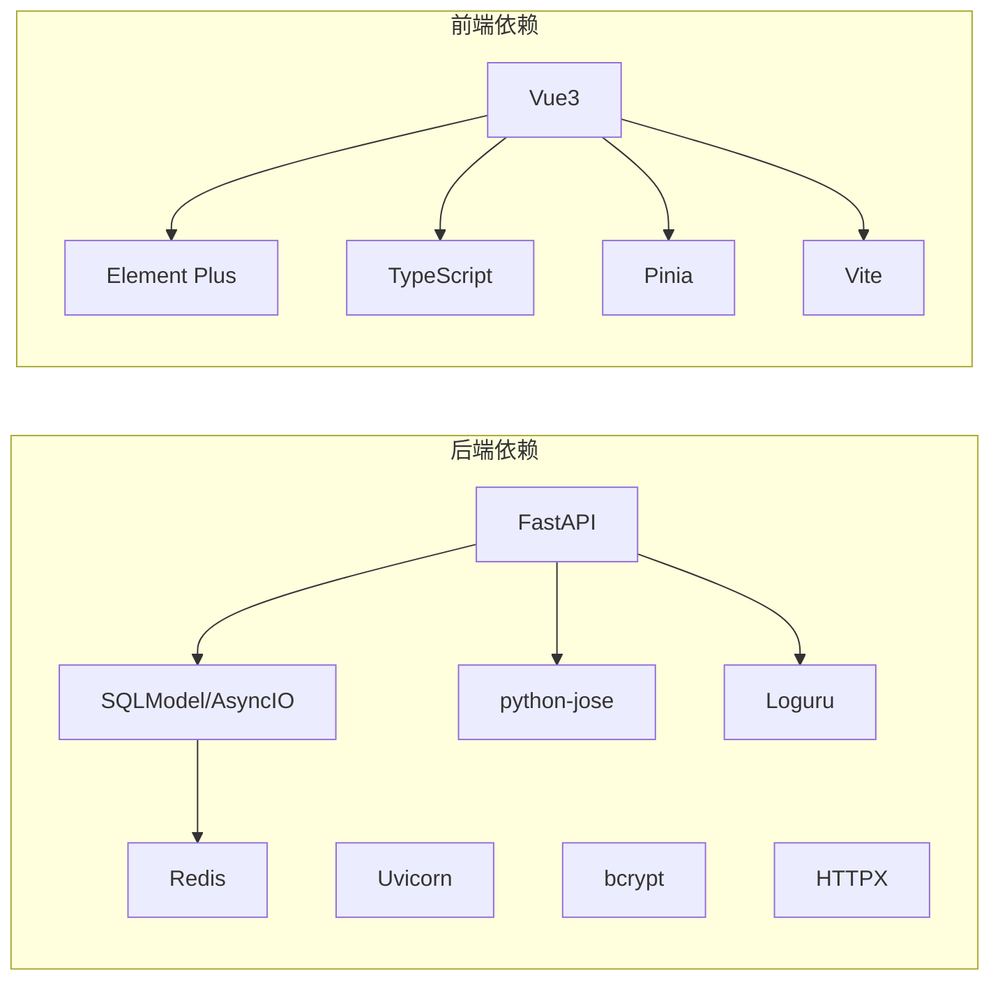

# 项目概述

<cite>
**本文引用的文件**
- [service/README.md](file://service/README.md)
- [web/README.md](file://web/README.md)
- [service/pyproject.toml](file://service/pyproject.toml)
- [web/package.json](file://web/package.json)
- [service/src/main.py](file://service/src/main.py)
- [service/src/config/settings.py](file://service/src/config/settings.py)
- [service/src/config/asgi.py](file://service/src/config/asgi.py)
- [service/src/domain/user/repository.py](file://service/src/domain/user/repository.py)
- [service/src/application/services/user_service.py](file://service/src/application/services/user_service.py)
- [service/src/api/v1/user_routes.py](file://service/src/api/v1/user_routes.py)
- [service/src/infrastructure/repositories/user_repository.py](file://service/src/infrastructure/repositories/user_repository.py)
- [service/src/infrastructure/database/models.py](file://service/src/infrastructure/database/models.py)
</cite>

## 目录
1. [引言](#引言)
2. [项目结构](#项目结构)
3. [核心组件](#核心组件)
4. [架构总览](#架构总览)
5. [详细组件分析](#详细组件分析)
6. [依赖分析](#依赖分析)
7. [性能考虑](#性能考虑)
8. [故障排查指南](#故障排查指南)
9. [结论](#结论)
10. [附录](#附录)

## 引言
Hello-FastApi 是一个基于 FastAPI 的现代化 RESTful API 服务，采用领域驱动设计（DDD）分层架构与 RBAC（基于角色的访问控制）权限体系，结合 JWT 认证、异步数据库访问与类型安全的数据验证，提供高内聚、低耦合、可扩展的后端能力。前端采用 Vue3 + Vite + Element Plus 的中后台模板，二者协同构成“服务端 + 前端”的完整演示与工程化样板。

本项目旨在为初学者提供清晰的学习路径，同时为有经验的开发者提供可直接落地的工程实践：模块化分层、统一异常与响应、可插拔的中间件与日志、灵活的多环境配置、完善的权限与菜单体系，以及 Docker 与生产部署建议。

## 项目结构
项目采用前后端分离的双仓库结构：
- service：后端 API 服务，基于 FastAPI + SQLModel + AsyncIO，遵循 DDD 分层。
- web：前端中后台模板，基于 Vue3 + Vite + Element Plus，提供丰富的业务页面与组件生态。

图表来源
- [service/src/main.py:1-96](file://service/src/main.py#L1-L96)
- [service/src/config/settings.py:1-198](file://service/src/config/settings.py#L1-L198)
- [service/src/config/asgi.py:1-6](file://service/src/config/asgi.py#L1-L6)
- [service/src/api/v1/user_routes.py:1-252](file://service/src/api/v1/user_routes.py#L1-L252)
- [service/src/application/services/user_service.py:1-322](file://service/src/application/services/user_service.py#L1-L322)
- [service/src/domain/user/repository.py:1-50](file://service/src/domain/user/repository.py#L1-L50)
- [service/src/infrastructure/repositories/user_repository.py:1-185](file://service/src/infrastructure/repositories/user_repository.py#L1-L185)
- [service/src/infrastructure/database/models.py:1-193](file://service/src/infrastructure/database/models.py#L1-L193)
- [web/package.json:1-210](file://web/package.json#L1-L210)
- [web/README.md:1-239](file://web/README.md#L1-L239)

章节来源
- [service/README.md:27-93](file://service/README.md#L27-L93)
- [service/src/main.py:34-96](file://service/src/main.py#L34-L96)
- [service/src/config/settings.py:41-198](file://service/src/config/settings.py#L41-L198)

## 核心组件
- 应用工厂与生命周期：负责 FastAPI 实例创建、CORS、请求日志中间件、全局异常处理、健康检查与路由注册。
- 配置系统：支持 development/production/testing 三套配置，按优先级从环境变量到 .env.* 文件加载，提供缓存单例。
- 路由层：以 v1 版本聚合认证、用户、RBAC、菜单等接口，统一鉴权与权限校验。
- 应用服务层：封装业务流程，协调仓储与领域服务，保证事务边界与数据一致性。
- 领域层：定义用户、角色、权限、菜单等核心领域模型与仓储接口，确保业务不变式。
- 基础设施层：SQLModel ORM、Redis 缓存、数据库连接与模型定义，屏蔽技术细节。

章节来源
- [service/src/main.py:19-96](file://service/src/main.py#L19-L96)
- [service/src/config/settings.py:144-198](file://service/src/config/settings.py#L144-L198)
- [service/src/api/v1/user_routes.py:1-252](file://service/src/api/v1/user_routes.py#L1-L252)
- [service/src/application/services/user_service.py:18-322](file://service/src/application/services/user_service.py#L18-L322)
- [service/src/domain/user/repository.py:8-50](file://service/src/domain/user/repository.py#L8-L50)
- [service/src/infrastructure/repositories/user_repository.py:11-185](file://service/src/infrastructure/repositories/user_repository.py#L11-L185)
- [service/src/infrastructure/database/models.py:31-193](file://service/src/infrastructure/database/models.py#L31-L193)

## 架构总览
本项目采用 DDD 分层架构，围绕“路由层 → 应用服务层 → 领域层 → 基础设施层”展开，配合 RBAC 权限控制与 JWT 认证，形成清晰的职责边界与可扩展性。

图表来源
- [service/src/api/v1/user_routes.py:1-252](file://service/src/api/v1/user_routes.py#L1-L252)
- [service/src/application/services/user_service.py:18-322](file://service/src/application/services/user_service.py#L18-L322)
- [service/src/domain/user/repository.py:8-50](file://service/src/domain/user/repository.py#L8-L50)
- [service/src/infrastructure/repositories/user_repository.py:11-185](file://service/src/infrastructure/repositories/user_repository.py#L11-L185)
- [service/src/infrastructure/database/models.py:31-193](file://service/src/infrastructure/database/models.py#L31-L193)

## 详细组件分析

### 用户管理模块（路由 → 应用服务 → 仓储）
用户管理覆盖列表、创建、详情、更新、删除、批量删除、重置密码、状态变更与密码修改等接口。权限通过装饰器进行细粒度控制，应用服务负责业务编排与异常处理，仓储负责数据持久化。

图表来源
- [service/src/api/v1/user_routes.py:54-74](file://service/src/api/v1/user_routes.py#L54-L74)
- [service/src/application/services/user_service.py:25-58](file://service/src/application/services/user_service.py#L25-L58)
- [service/src/infrastructure/repositories/user_repository.py:114-119](file://service/src/infrastructure/repositories/user_repository.py#L114-L119)

章节来源
- [service/src/api/v1/user_routes.py:1-252](file://service/src/api/v1/user_routes.py#L1-L252)
- [service/src/application/services/user_service.py:18-322](file://service/src/application/services/user_service.py#L18-L322)
- [service/src/infrastructure/repositories/user_repository.py:11-185](file://service/src/infrastructure/repositories/user_repository.py#L11-L185)

### RBAC 权限模型与数据结构
RBAC 通过“用户-角色-权限”三层关系实现，菜单可绑定权限编码，前端据此动态渲染路由与按钮权限。模型采用 SQLModel 定义，具备 ORM 与 Pydantic 的双重能力。

图表来源
- [service/src/infrastructure/database/models.py:31-193](file://service/src/infrastructure/database/models.py#L31-L193)

章节来源
- [service/src/infrastructure/database/models.py:17-193](file://service/src/infrastructure/database/models.py#L17-L193)

### JWT 认证与权限中间件
- 认证：登录成功签发访问令牌与刷新令牌，支持刷新。
- 授权：通过 require_permission 装饰器在路由层进行权限校验，结合用户的角色与权限集合判断。
- 安全：密码使用哈希服务，敏感配置通过多环境配置系统管理。

章节来源
- [service/src/api/v1/user_routes.py:10-22](file://service/src/api/v1/user_routes.py#L10-L22)
- [service/src/application/services/user_service.py:283-322](file://service/src/application/services/user_service.py#L283-L322)
- [service/src/config/settings.py:63-80](file://service/src/config/settings.py#L63-L80)

### 配置系统与多环境
- 环境：development/production/testing，按优先级加载配置。
- 关键项：数据库连接、Redis、JWT 秘钥、CORS、限流、日志级别等。
- 缓存：lru_cache 单例，避免重复解析环境变量。

章节来源
- [service/src/config/settings.py:144-198](file://service/src/config/settings.py#L144-L198)
- [service/src/config/settings.py:170-183](file://service/src/config/settings.py#L170-L183)

### 应用生命周期与中间件
- 生命周期：启动时初始化数据库，关闭时释放连接。
- 中间件：CORS、请求日志、全局异常处理（AppException、验证错误、通用异常）。
- 健康检查：/health 返回版本信息。

章节来源
- [service/src/main.py:19-96](file://service/src/main.py#L19-L96)

## 依赖分析
- 后端依赖：FastAPI、Uvicorn、SQLModel + AsyncIO、Pydantic Settings、python-jose、bcrypt、Redis、Loguru、HTTPX 等。
- 前端依赖：Vue3、Element Plus、TypeScript、Pinia、Tailwindcss、Vite 等。
- 开发工具：pytest、ruff、mypy、husky、lint-staged 等。

图表来源
- [service/pyproject.toml:7-20](file://service/pyproject.toml#L7-L20)
- [web/package.json:49-114](file://web/package.json#L49-L114)

章节来源
- [service/pyproject.toml:1-76](file://service/pyproject.toml#L1-L76)
- [web/package.json:1-210](file://web/package.json#L1-L210)

## 性能考虑
- 异步并发：基于 async/await 与异步数据库驱动，适合高并发 I/O 场景。
- 类型安全：Pydantic 与 SQLModel 提升数据校验效率与可维护性。
- 缓存：Redis 用于热点数据与会话存储，降低数据库压力。
- 日志：Loguru 提供结构化日志，便于性能监控与问题定位。
- 部署：生产建议使用 Gunicorn + Uvicorn Worker，结合 Nginx 做反向代理与静态资源分发。

## 故障排查指南
- 启动失败：检查环境变量与 .env.* 文件是否存在，确认 APP_ENV 与配置文件匹配。
- 数据库连接：确认 DATABASE_URL 与数据库服务可用，首次启动可执行初始化命令。
- 权限错误：确认用户角色与权限分配，检查菜单 permissions 字段与权限编码一致。
- 参数校验：422 错误通常来自 Pydantic 校验失败，检查请求体字段类型与约束。
- 未捕获异常：查看日志输出，定位异常堆栈并补充 AppException 子类处理。

章节来源
- [service/src/main.py:60-83](file://service/src/main.py#L60-L83)
- [service/src/config/settings.py:144-198](file://service/src/config/settings.py#L144-L198)

## 结论
Hello-FastApi 将现代 Web 技术与工程化最佳实践相结合，通过 DDD 分层与 RBAC 权限体系，提供了清晰、可扩展、易维护的后端骨架。前后端分离的结构便于团队协作与独立演进，配合完善的开发与部署工具链，能够快速支撑中大型业务系统的建设。

## 附录
- 快速开始与环境准备：参见后端 README 的“快速开始”与“环境配置”章节。
- API 文档：启动后访问 /api/docs 与 /api/redoc。
- 部署：支持 Docker Compose 与生产环境 Gunicorn+Nginx 方案。

章节来源
- [service/README.md:95-188](file://service/README.md#L95-L188)
- [service/README.md:240-259](file://service/README.md#L240-L259)