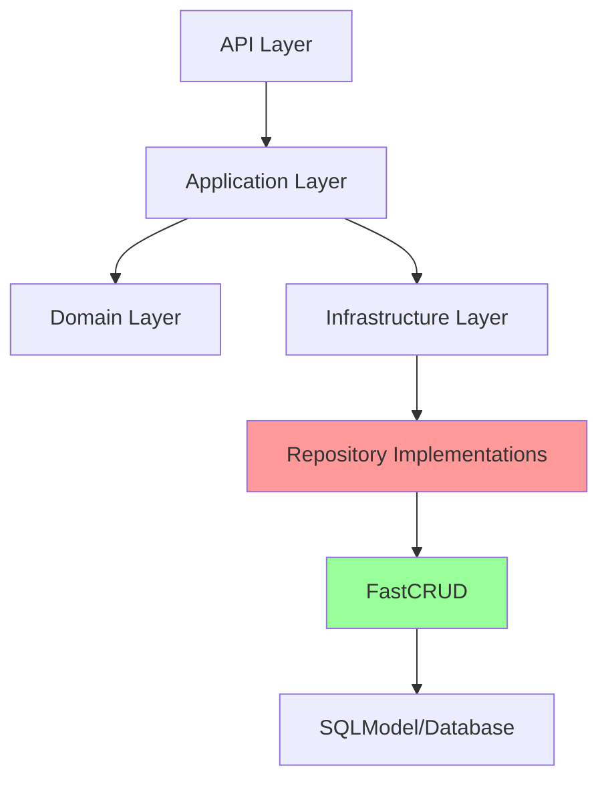

## 用户需求

引入 fastcrud 库精简当前 FastAPI + DDD 项目的代码，保持所有功能不变。

## 产品概述

当前项目是基于 FastAPI + SQLModel 的后端管理系统，采用 DDD 四层架构，包含用户管理、RBAC 权限控制、菜单管理、部门管理、日志管理等功能模块。系统存在大量重复的 CRUD 代码，仓储层每个实体都实现了相似的增删改查逻辑。

## 核心功能

1. **用户管理**：用户增删改查、密码管理、状态管理、角色分配
2. **RBAC 权限**：角色管理、权限管理、用户-角色-权限关联
3. **菜单管理**：菜单树管理、用户菜单获取
4. **部门管理**：部门树管理
5. **日志管理**：登录日志、操作日志、系统日志
6. **认证授权**：JWT 双令牌认证、权限验证

## 技术栈

### 现有技术栈

- **框架**：FastAPI ≥0.115
- **ORM**：SQLModel ≥0.0.22（fastcrud 已支持）
- **数据库**：SQLite（开发）/ PostgreSQL（生产）
- **认证**：JWT（python-jose）
- **验证**：Pydantic V2
- **架构**：DDD 四层架构

### 新增依赖

- **fastcrud**：提供 FastCRUD 类封装常见 CRUD 操作，支持 SQLModel

## 实施方案

### 重构策略

**核心原则**：

1. **最小改动**：只在仓储实现层使用 fastcrud，保留 DDD 架构和依赖倒置原则
2. **接口保留**：保留仓储接口定义，确保应用层不受影响
3. **业务逻辑不变**：应用服务层的业务验证、异常处理、数据转换保持不变
4. **API 兼容**：所有 API 端点、请求/响应格式完全兼容

**重构范围**：



### 仓储层重构方案

**当前实现（重复代码）**：

```python
# 每个 Repository 都有类似代码
async def get_by_id(self, id: str) -> Model | None:
    result = await self.session.exec(select(Model).where(Model.id == id))
    return result.one_or_none()

async def create(self, entity: Model) -> Model:
    self.session.add(entity)
    await self.session.flush()
    await self.session.refresh(entity)
    return entity
# ... 其他 CRUD 方法
```

**重构后（使用 FastCRUD）**：

```python
from fastcrud import FastCRUD

class UserRepository(UserRepositoryInterface):
    def __init__(self, session: AsyncSession):
        self._crud = FastCRUD(User)
        self.session = session
    
    async def get_by_id(self, user_id: str) -> User | None:
        return await self._crud.get(self.session, id=user_id)
    
    async def get_by_username(self, username: str) -> User | None:
        return await self._crud.get_one(self.session, username=username)
    
    async def create(self, user: User) -> User:
        return await self._crud.create(self.session, user)
    # 复杂查询保留自定义实现
```

### 性能与可靠性

- **查询性能**：fastcrud 使用 SQLAlchemy 2.0 优化查询，性能不低于当前实现
- **事务控制**：保持现有 session 管理机制，事务边界不变
- **错误处理**：保留现有异常处理逻辑，确保业务异常正确抛出
- **向后兼容**：所有方法签名保持不变，上层代码无需修改

## 架构设计

### DDD 架构保持不变

```
┌─────────────────────────────────────────┐
│         API Layer (api/v1/)             │
│  - user_routes, rbac_routes, etc.       │
└──────────────┬──────────────────────────┘
               │
┌──────────────▼──────────────────────────┐
│      Application Layer (services/)      │
│  - UserService, RBACService, etc.       │
│  - 业务逻辑、验证、DTO 转换              │
└──────────────┬──────────────────────────┘
               │
┌──────────────▼──────────────────────────┐
│       Domain Layer (entities/)          │
│  - UserEntity, RoleEntity, etc.         │
│  - 仓储接口定义（不变）                   │
└──────────────┬──────────────────────────┘
               │
┌──────────────▼──────────────────────────┐
│  Infrastructure Layer (repositories/)   │
│  - 使用 FastCRUD 简化 CRUD 实现          │  ← 重构重点
│  - 复杂查询保留自定义实现                 │
└─────────────────────────────────────────┘
```

### 仓储层实现变化

| 仓储类 | 使用 FastCRUD 的方法 | 保留自定义实现的方法 |
| --- | --- | --- |
| UserRepository | get_by_id, create, update, delete, count | get_by_username, get_by_email, get_all（带复杂筛选）、batch_delete、update_status、reset_password |
| RoleRepository | get_by_id, create, update, delete | get_by_code, get_all（带筛选）、assign_permissions |
| PermissionRepository | get_by_id, create, update, delete | get_by_code, get_all、get_user_permissions |
| MenuRepository | get_by_id, create, update, delete | get_all（排序）、get_by_parent_id |
| DepartmentRepository | get_by_id, create, update, delete | get_all（排序）、get_by_name、get_by_parent_id |
| LogRepository | create, get_by_id | get_all（带复杂筛选和分页） |


## 目录结构

### 修改的文件

```
e:/GitHub/Hello-FastApi/service/
├── pyproject.toml                                      # [MODIFY] 添加 fastcrud 依赖
└── src/
    └── infrastructure/
        └── repositories/
            ├── base.py                                 # [DELETE] 不再需要 BaseRepository
            ├── user_repository.py                      # [MODIFY] 使用 FastCRUD 重构
            ├── rbac_repository.py                      # [MODIFY] 使用 FastCRUD 重构
            ├── menu_repository.py                      # [MODIFY] 使用 FastCRUD 重构
            ├── department_repository.py                # [MODIFY] 使用 FastCRUD 重构
            └── log_repository.py                       # [MODIFY] 使用 FastCRUD 重构
```

### 文件详细说明

#### pyproject.toml

- **修改内容**：在 dependencies 中添加 `"fastcrud>=0.15.0"`
- **影响范围**：需要重新安装依赖

#### src/infrastructure/repositories/base.py

- **处理方式**：删除此文件，不再需要自定义 BaseRepository
- **原因**：fastcrud 的 FastCRUD 类已提供更完善的 CRUD 封装

#### src/infrastructure/repositories/user_repository.py

- **重构内容**：
- 使用 `FastCRUD(User)` 替代手动 SQL 查询
- 基础 CRUD 方法委托给 fastcrud
- 保留自定义方法：get_by_username、get_by_email、get_all（复杂筛选）、batch_delete、update_status、reset_password
- 方法签名保持不变，确保应用层兼容

#### src/infrastructure/repositories/rbac_repository.py

- **重构内容**：
- RoleRepository 和 PermissionRepository 使用 FastCRUD
- 保留复杂查询：角色分配、权限检查、多表关联查询

#### src/infrastructure/repositories/menu_repository.py

- **重构内容**：
- 基础 CRUD 使用 FastCRUD
- 保留自定义方法：get_all（按 order_num 排序）、get_by_parent_id

#### src/infrastructure/repositories/department_repository.py

- **重构内容**：
- 基础 CRUD 使用 FastCRUD
- 保留自定义方法：get_by_name、get_by_parent_id

#### src/infrastructure/repositories/log_repository.py

- **重构内容**：
- LoginLog、OperationLog、SystemLog 的基础 CRUD 使用 FastCRUD
- 保留复杂查询：带筛选条件的分页查询

## 实施注意事项

1. **依赖版本**：fastcrud 要求 SQLModel ≥0.14，当前项目已满足（0.0.22）
2. **异步支持**：fastcrud 原生支持异步操作，与当前 async/await 模式完全兼容
3. **会话管理**：保持现有 session 注入机制，fastcrud 接受 session 参数
4. **类型安全**：fastcrud 支持泛型，保持类型提示完整性
5. **测试兼容**：现有测试用例应全部通过，无需修改测试代码
6. **日志记录**：fastcrud 内部操作透明，不影响现有日志记录

## 预期收益

1. **代码量减少**：预计仓储层代码减少 40-50%
2. **维护成本降低**：CRUD 逻辑由 fastcrud 维护，减少 bug 风险
3. **一致性提升**：统一的 CRUD 实现模式
4. **扩展性增强**：新增实体只需少量代码即可获得完整 CRUD 功能

## 使用 Agent Extensions

### Skill

- **python-code-quality**
- Purpose：在重构仓储层代码时，确保遵循 Python 最佳实践（SOLID 原则、类型注解、现代 Python 特性）
- Expected outcome：生成高质量、符合规范的仓储实现代码，保持代码可读性和可维护性