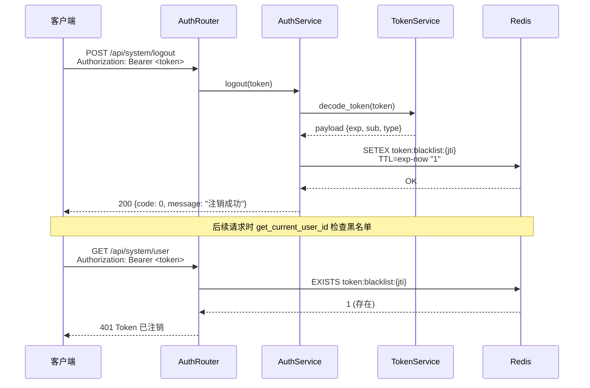
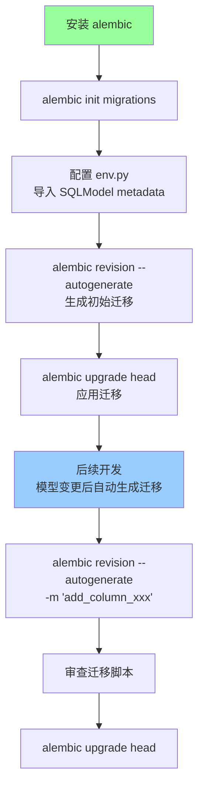
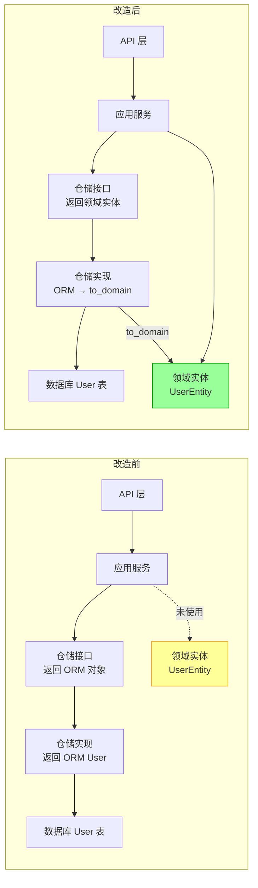
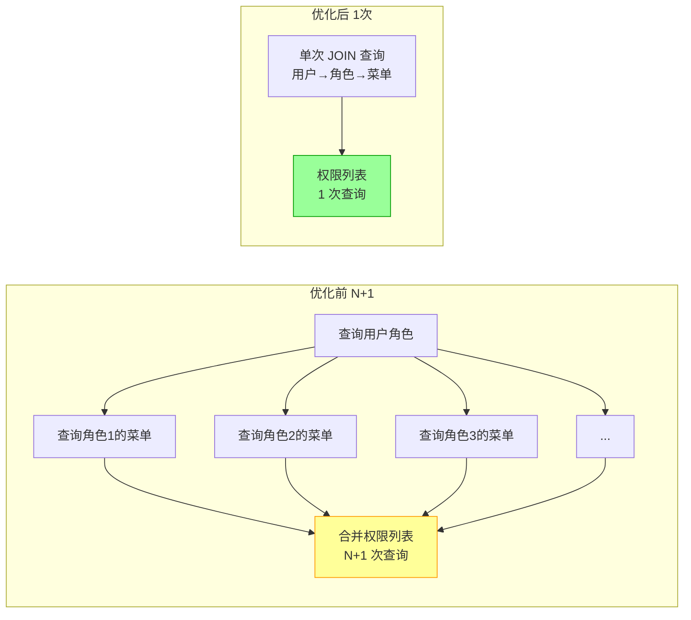
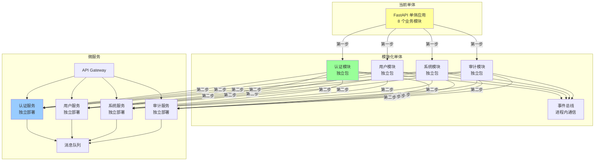
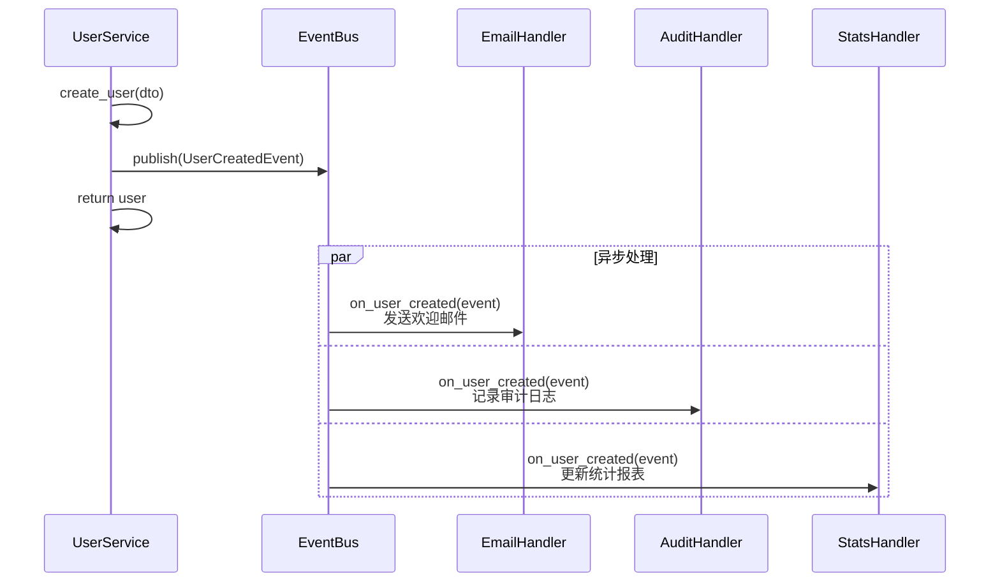
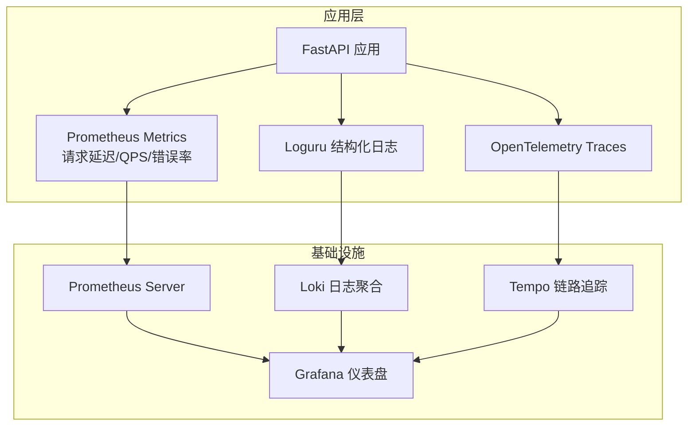

# Hello-FastApi 大型项目演进路线图

> 基于系统框架分析报告，制定从当前状态到大型项目可支撑的演进路径

---

## 一、演进阶段总览


| 阶段 | 目标 | 核心改造项 | 适用规模 |
|------|------|-----------|---------|
| 阶段一 | 生产就绪 | 安全补全 + 迁移工具 | 小型项目上线 |
| 阶段二 | 架构加固 | DDD 落地 + 性能优化 | 中型项目演进 |
| 阶段三 | 规模支撑 | 微服务 + 可观测 | 大型项目支撑 |

---

## 二、阶段一：生产就绪

### 2.1 安全补全

#### Token 黑名单（注销功能）



**改造要点**：
- Token payload 添加 `jti`（JWT ID）字段作为黑名单 key
- `AuthService.logout()` 将 jti 写入 Redis，TTL = token 剩余过期时间
- `get_current_user_id()` 解码后先查 Redis 黑名单
- Redis 连接通过依赖注入传入 AuthService

#### 限流中间件

```python
# 实现思路：滑动窗口 + Redis
class RateLimitMiddleware:
    async def __call__(self, request, call_next):
        key = f"ratelimit:{client_ip}:{path}"
        current = await redis.incr(key)
        if current == 1:
            await redis.expire(key, settings.RATE_LIMIT_SECONDS)
        if current > settings.RATE_LIMIT_TIMES:
            raise RateLimitError("请求过于频繁")
        return await call_next(request)
```

#### IP 过滤启用

将已有的 `IPFilterMiddleware` 注册到 `create_app()`，从 `sys_ip_rules` 表加载规则。

### 2.2 数据库迁移

#### Alembic 集成步骤



**关键配置**：
- `env.py` 中 `target_metadata = SQLModel.metadata`
- 配置多环境 URL（dev/test/prod）
- 迁移脚本纳入代码评审

### 2.3 Docker Compose 补全

```yaml
# 目标架构
services:
  app:
    depends_on:
      db: { condition: service_healthy }
      redis: { condition: service_healthy }
  db:
    image: postgres:16
    volumes: [pgdata:/var/lib/postgresql/data]
    healthcheck: ...
  redis:
    image: redis:7-alpine
    healthcheck: ...
volumes:
  pgdata:
```

---

## 三、阶段二：架构加固

### 3.1 领域实体激活

#### 改造前后对比



#### 改造步骤

1. **仓储接口签名修改**：`async def get_by_id(id) -> UserEntity | None`
2. **仓储实现添加转换**：`return model.to_domain() if model else None`
3. **写入方法使用 from_domain**：`model = UserModel.from_domain(entity)`
4. **应用服务使用领域实体**：业务逻辑操作 `UserEntity` 而非 `User`
5. **领域实体添加业务方法**：如 `user.activate()`, `user.change_password()`

#### 领域实体增强示例

```python
@dataclass
class UserEntity:
    id: str
    username: str
    password: str
    is_active: int
    is_superuser: int
    # ...

    def activate(self) -> None:
        """激活用户 — 业务规则封装在领域层"""
        if self.is_active == 1:
            raise BusinessError("用户已处于激活状态")
        self.is_active = 1

    def change_password(self, old_password: str, new_password: str,
                        password_service: PasswordService) -> None:
        """修改密码 — 验证旧密码，哈希新密码"""
        if not password_service.verify_password(old_password, self.password):
            raise UnauthorizedError("旧密码不正确")
        self.password = password_service.hash_password(new_password)
```

### 3.2 N+1 查询优化



**优化方案**：在 `MenuRepository` 中新增 `get_user_permissions(user_id)` 方法：

```sql
SELECT DISTINCT m.name
FROM sys_menus m
JOIN sys_userrole_menu rm ON m.id = rm.menu_id
JOIN sys_userinfo_roles ur ON rm.userrole_id = ur.userrole_id
WHERE ur.userinfo_id = :user_id AND m.menu_type = 2
```

### 3.3 批量操作优化

| 操作 | 优化前 | 优化后 |
|------|--------|--------|
| 批量删除 | 逐条 DELETE | `WHERE id IN (...)` 单次 DELETE |
| 角色分配 | DELETE ALL + 逐条 INSERT | DELETE ALL + 批量 INSERT |
| 菜单分配 | 同上 | 同上 |

### 3.4 依赖注入容器化

当模块超过 15 个时，手动 DI 工厂维护成本高。建议引入 `dependency-injector`：

```python
from dependency_injector import containers, providers

class Container(containers.DeclarativeContainer):
    session = providers.Dependency(instance_of=AsyncSession)

    user_repo = providers.Factory(UserRepository, session=session)
    role_repo = providers.Factory(RoleRepository, session=session)

    token_service = providers.Factory(TokenService, ...)
    password_service = providers.Factory(PasswordService)

    auth_service = providers.Factory(
        AuthService,
        session=session,
        user_repo=user_repo,
        role_repo=role_repo,
        token_service=token_service,
        password_service=password_service,
    )
```

---

## 四、阶段三：规模支撑

### 4.1 微服务拆分路径



**拆分原则**：
1. 先做模块化单体（模块间通过事件总线通信）
2. 每个模块有独立的仓储、服务、DTO
3. 模块间禁止直接调用应用服务，通过领域事件解耦
4. 需要独立部署的模块再拆为微服务

### 4.2 事件驱动架构



### 4.3 可观测性体系



### 4.4 配置中心集成

| 方案 | 适用场景 | 与 pydantic-settings 集成难度 |
|------|---------|------------------------------|
| Nacos | Spring Cloud 生态为主 | 中 |
| Apollo | 携程开源，功能完善 | 中 |
| Consul | Go 生态，KV + 服务发现 | 低 |
| ETCD | K8s 原生 | 低 |

建议通过自定义 `pydantic-settings` 的 `settings_customise_sources` 方法集成配置中心。

---

## 五、技术选型升级建议

| 当前技术 | 建议升级 | 原因 |
|---------|---------|------|
| python-jose | PyJWT | 维护活跃、安全性更好 |
| classy-fastapi | 原生 APIRouter | 生态兼容性、维护风险 |
| SQLModel 0.0.x | 关注 SQLAlchemy 2.x + Pydantic v2 直连 | SQLModel 版本不稳定 |
| 手动 DI 工厂 | dependency-injector | 模块增长后可维护性 |
| create_all() | Alembic | 生产环境必需 |
| uvicorn 直接部署 | Gunicorn + Uvicorn workers | 生产级进程管理 |
| 无 CI/CD | GitHub Actions | 自动化质量保障 |

---

## 六、优先级与行动清单

### P0 — 生产上线前必须完成

- [ ] 集成 Alembic 数据库迁移
- [ ] 实现 Redis Token 黑名单（logout 安全）
- [ ] 实现限流中间件
- [ ] 启用 IP 过滤中间件
- [ ] Docker Compose 补全数据库和 Redis 服务
- [ ] 添加 CI/CD 基础流水线（lint + test）

### P1 — 架构质量提升

- [ ] 激活领域实体，仓储接口返回领域类型
- [ ] 修复 N+1 权限查询
- [ ] 优化批量删除为单次 SQL
- [ ] 统一审计日志事务
- [ ] 替换 python-jose 为 PyJWT
- [ ] 补充仓储层测试

### P2 — 规模支撑准备

- [ ] 引入事件驱动架构
- [ ] 模块化单体改造（独立包 + 事件总线）
- [ ] 引入依赖注入容器
- [ ] 可观测性集成（Metrics + Logs + Traces）
- [ ] 配置中心集成
- [ ] 替换 classy-fastapi 为原生 APIRouter
