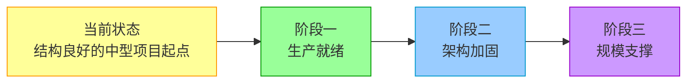
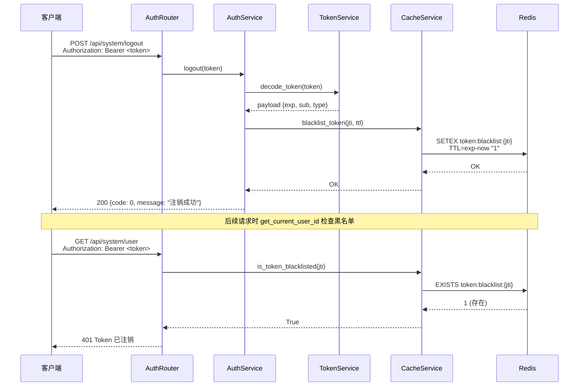
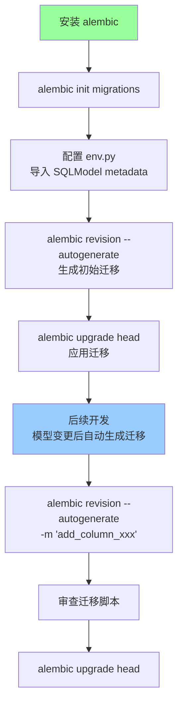
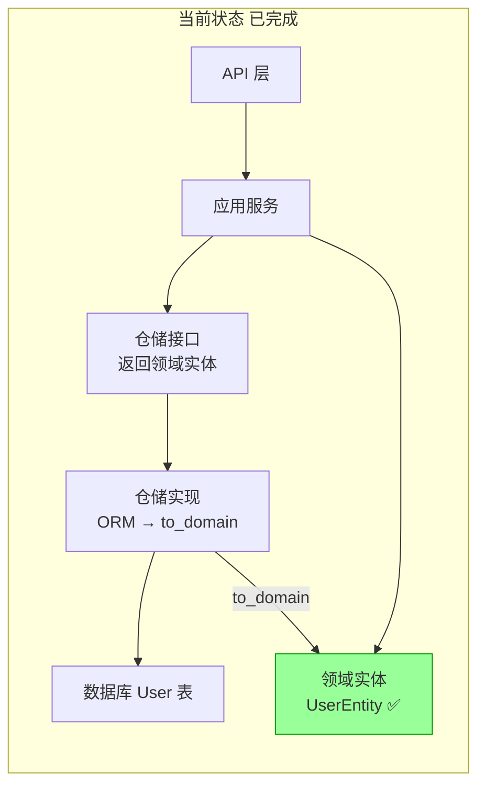
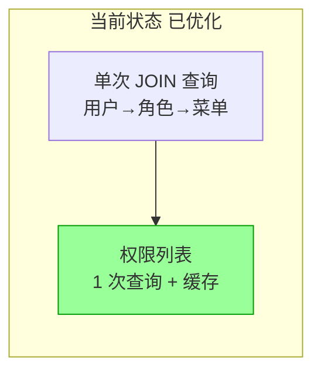
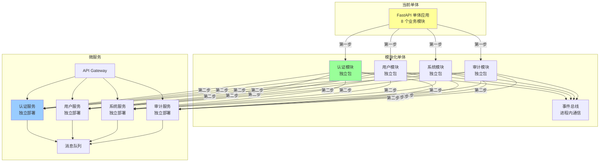
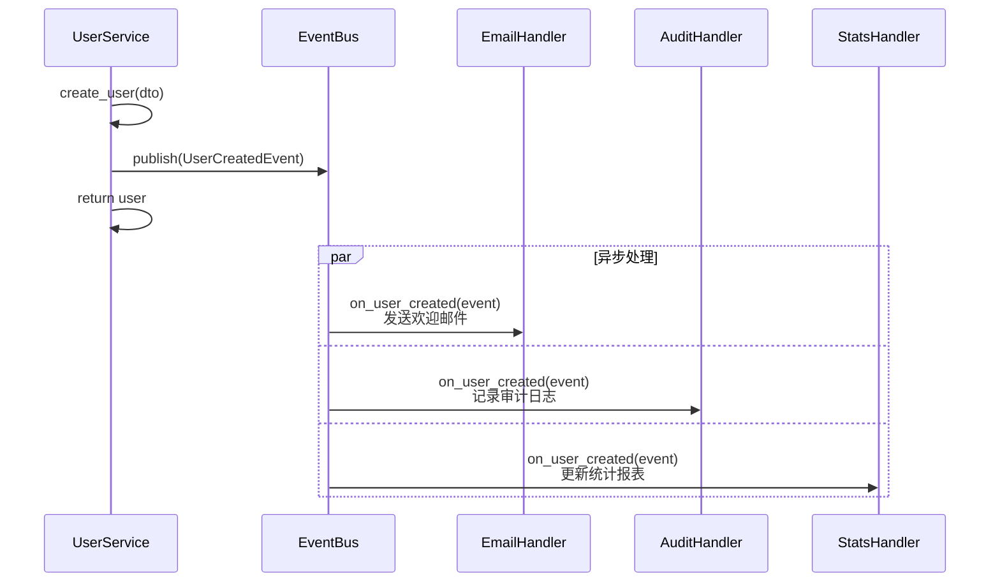
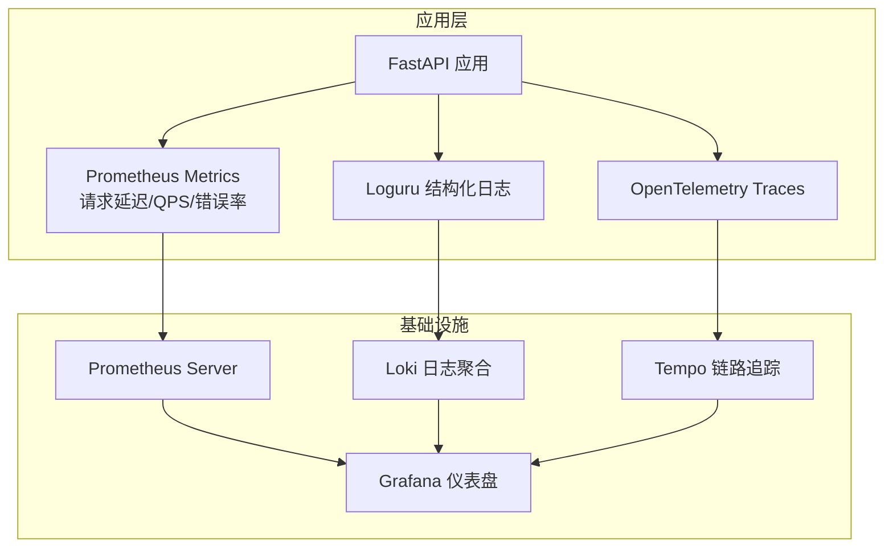

# Hello-FastApi 大型项目演进路线图

> 基于系统框架分析报告，制定从当前状态到大型项目可支撑的演进路径

---

## 一、演进阶段总览



| 阶段 | 目标 | 核心改造项 | 适用规模 |
|------|------|-----------|---------|
| 阶段一 | 生产就绪 | 安全补全 + 迁移工具 | 小型项目上线 |
| 阶段二 | 架构加固 | ~~DDD 落地~~ ✅ + 性能优化 ✅ + 分层修复 | 中型项目演进 |
| 阶段三 | 规模支撑 | 微服务 + 可观测 | 大型项目支撑 |

---

## 二、阶段一：生产就绪

### 2.1 安全补全

#### ✅ Token 黑名单（注销功能）— 已完成



**实现说明**：
- `AuthService.logout()` 通过 `CacheService` 将 jti 写入 Redis，TTL = token 剩余过期时间
- `get_current_user_id()` 解码后通过 `CacheService.is_token_blacklisted()` 检查黑名单
- `CacheService` 封装 Redis 操作，支持 Redis 不可用时降级为无缓存模式

#### 限流中间件

```python
# 实现思路：滑动窗口 + Redis
class RateLimitMiddleware:
    async def __call__(self, request, call_next):
        key = f"ratelimit:{client_ip}:{path}"
        current = await redis.incr(key)
        if current == 1:
            await redis.expire(key, settings.RATE_LIMIT_SECONDS)
        if current > settings.RATE_LIMIT_TIMES:
            raise RateLimitError("请求过于频繁")
        return await call_next(request)
```

#### ✅ IP 过滤启用 — 已完成

`IPFilterMiddleware` 已注册到 `create_app()`，`IPFilterCache` 实现规则缓存和自动刷新机制，从 `sys_ip_rules` 表加载规则。

### 2.2 数据库迁移

#### Alembic 集成步骤



**关键配置**：
- `env.py` 中 `target_metadata = SQLModel.metadata`
- 配置多环境 URL（dev/test/prod）
- 迁移脚本纳入代码评审

### 2.3 Docker Compose 补全

```yaml
# 目标架构
services:
  app:
    depends_on:
      db: { condition: service_healthy }
      redis: { condition: service_healthy }
  db:
    image: postgres:16
    volumes: [pgdata:/var/lib/postgresql/data]
    healthcheck: ...
  redis:
    image: redis:7-alpine
    healthcheck: ...
volumes:
  pgdata:
```

---

## 三、阶段二：架构加固

### 3.1 ✅ 领域实体激活 — 已完成

#### ~~改造前后对比~~ 改造结果



**已完成改造**：
1. ✅ 仓储接口签名已修改，返回 `UserEntity` 等领域实体类型
2. ✅ 仓储实现在 `get_by_id` 中调用 `model.to_domain()`
3. ✅ 仓储实现在 `create`/`update` 中调用 `Model.from_domain(entity)`
4. ✅ 应用服务操作领域实体而非 ORM 对象

**残留问题**：
- 实体行为方法（如 `activate()`/`deactivate()`）未被应用层充分调用
- `MenuService._dict_to_entity()` 访问私有属性 `menu._meta`

#### 改造步骤

1. **仓储接口签名修改**：`async def get_by_id(id) -> UserEntity | None`
2. **仓储实现添加转换**：`return model.to_domain() if model else None`
3. **写入方法使用 from_domain**：`model = UserModel.from_domain(entity)`
4. **应用服务使用领域实体**：业务逻辑操作 `UserEntity` 而非 `User`
5. **领域实体添加业务方法**：如 `user.activate()`, `user.change_password()`

#### 领域实体行为方法增强（待完善）

当前实体已定义 `activate()` / `deactivate()` 等行为方法，但应用层未充分调用：

```python
# 当前状态：应用层直接修改字段
user.update_info(is_active=1)  # 绕过实体行为方法

# 期望状态：通过实体行为方法操作
user.activate()  # 由实体封装业务规则
```

**待改进**：应用服务应调用实体行为方法，而非直接通过 `update_info` 修改状态字段。

### 3.2 ✅ N+1 查询优化 — 已完成



**已实现优化**：`require_permission` 使用 `get_user_all_menus()` 单次 JOIN 查询，权限数据通过 `CacheService` 缓存。

### 3.3 ✅ 批量操作优化 — 已完成

| 操作 | 状态 | 实现方式 |
|------|------|---------|
| 批量删除 | ✅ 已优化 | `UserRepository.batch_delete()` 使用 `WHERE id IN(...)` 单次 SQL |
| 角色分配 | DELETE ALL + 逐条 INSERT | 待优化为批量 INSERT |
| 菜单分配 | 同上 | 待优化为批量 INSERT |

### 3.4 依赖注入容器化

当模块超过 15 个时，手动 DI 工厂维护成本高。建议引入 `dependency-injector`：

```python
from dependency_injector import containers, providers

class Container(containers.DeclarativeContainer):
    session = providers.Dependency(instance_of=AsyncSession)

    user_repo = providers.Factory(UserRepository, session=session)
    role_repo = providers.Factory(RoleRepository, session=session)

    token_service = providers.Factory(TokenService, ...)
    password_service = providers.Factory(PasswordService)

    auth_service = providers.Factory(
        AuthService,
        session=session,
        user_repo=user_repo,
        role_repo=role_repo,
        token_service=token_service,
        password_service=password_service,
    )
```

---

## 四、阶段三：规模支撑

### 4.1 微服务拆分路径



**拆分原则**：
1. 先做模块化单体（模块间通过事件总线通信）
2. 每个模块有独立的仓储、服务、DTO
3. 模块间禁止直接调用应用服务，通过领域事件解耦
4. 需要独立部署的模块再拆为微服务

### 4.2 事件驱动架构



### 4.3 可观测性体系



### 4.4 配置中心集成

| 方案 | 适用场景 | 与 pydantic-settings 集成难度 |
|------|---------|------------------------------|
| Nacos | Spring Cloud 生态为主 | 中 |
| Apollo | 携程开源，功能完善 | 中 |
| Consul | Go 生态，KV + 服务发现 | 低 |
| ETCD | K8s 原生 | 低 |

建议通过自定义 `pydantic-settings` 的 `settings_customise_sources` 方法集成配置中心。

---

## 五、技术选型升级建议

| 当前技术 | 建议升级 | 原因 |
|---------|---------|------|
| python-jose | PyJWT | 维护活跃、安全性更好 |
| classy-fastapi | 原生 APIRouter | 生态兼容性、维护风险 |
| SQLModel 0.0.x | 关注 SQLAlchemy 2.x + Pydantic v2 直连 | SQLModel 版本不稳定 |
| 手动 DI 工厂 | dependency-injector | 模块增长后可维护性 |
| create_all() | Alembic | 生产环境必需 |
| uvicorn 直接部署 | Gunicorn + Uvicorn workers | 生产级进程管理 |
| 无 CI/CD | GitHub Actions | 自动化质量保障 |

---

## 六、优先级与行动清单

### P0 — 生产上线前必须完成

- [ ] 集成 Alembic 数据库迁移
- [x] ~~实现 Redis Token 黑名单（logout 安全）~~ ✅ 已完成
- [ ] 实现限流中间件
- [x] ~~启用 IP 过滤中间件~~ ✅ 已完成
- [ ] Docker Compose 补全数据库和 Redis 服务
- [ ] 添加 CI/CD 基础流水线（lint + test）

### P1 — 架构质量提升

- [x] ~~激活领域实体，仓储接口返回领域类型~~ ✅ 已完成
- [x] ~~修复 N+1 权限查询~~ ✅ 已完成
- [x] ~~优化批量删除为单次 SQL~~ ✅ 已完成
- [ ] 统一审计日志事务
- [ ] 替换 python-jose 为 PyJWT
- [ ] 补充仓储层测试
- [ ] **修复应用层分层约束违规** — IPRuleService/MenuService/UserService 直接导入基础设施层 CacheService/IPFilterCache
- [ ] **修复 IPRuleEntity 时区不一致** — `is_expired` 使用 `datetime.now()` 应改为 `datetime.now(timezone.utc)`
- [ ] **修复 MenuService 访问私有属性** — `menu._meta = meta_entity` 应通过构造函数或 setter

### P2 — 规模支撑准备

- [ ] 引入事件驱动架构
- [ ] 模块化单体改造（独立包 + 事件总线）
- [ ] 引入依赖注入容器
- [ ] 可观测性集成（Metrics + Logs + Traces）
- [ ] 配置中心集成
- [ ] 替换 classy-fastapi 为原生 APIRouter
