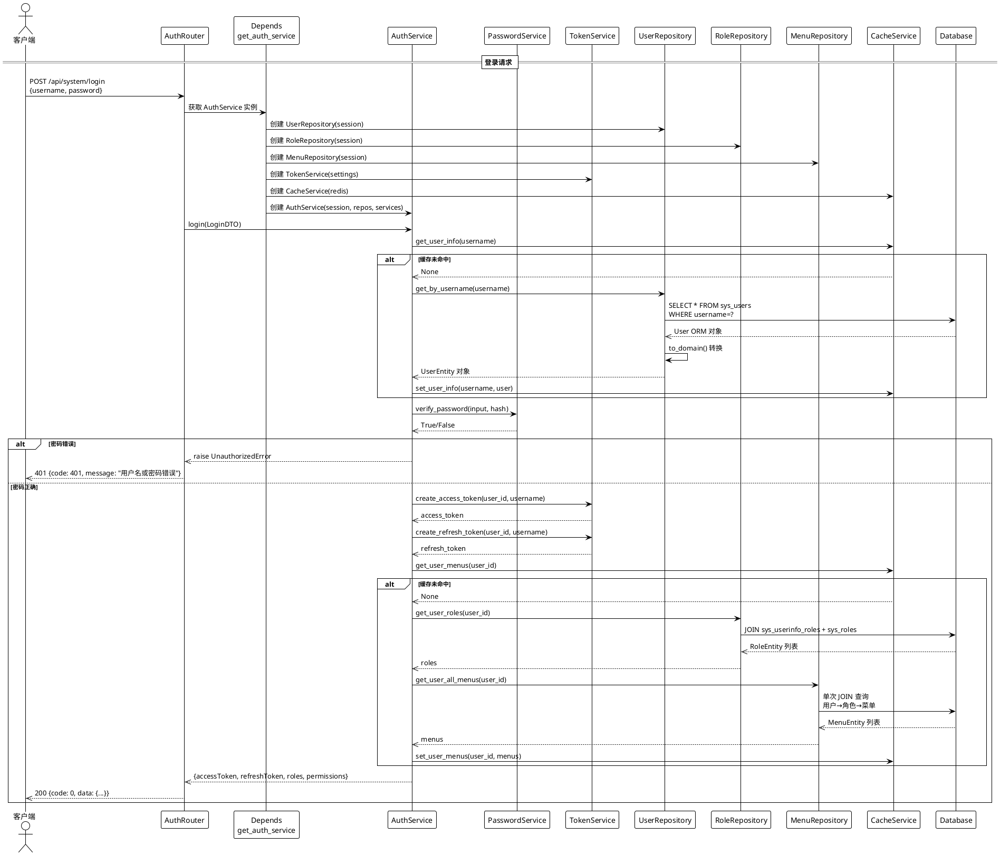
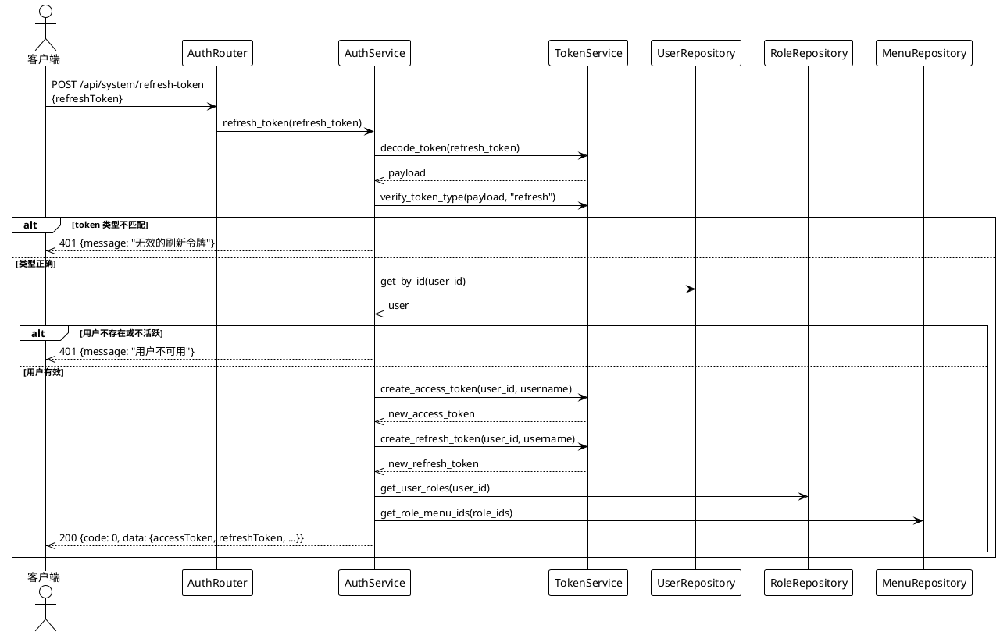
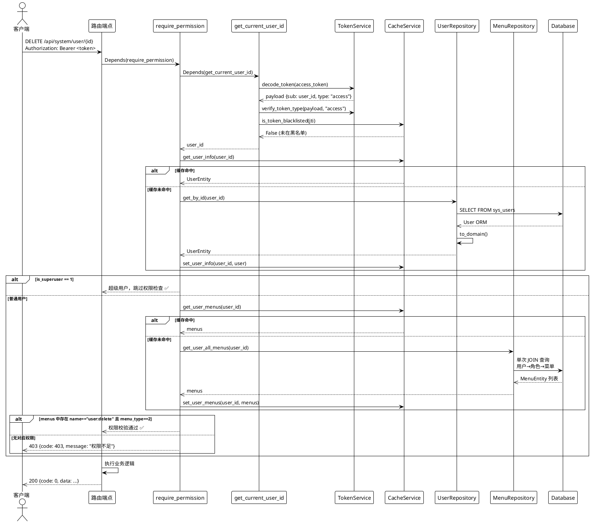
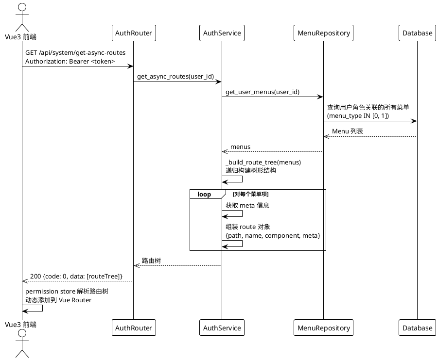
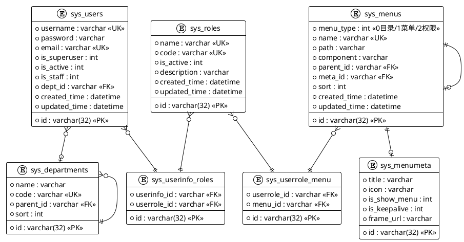
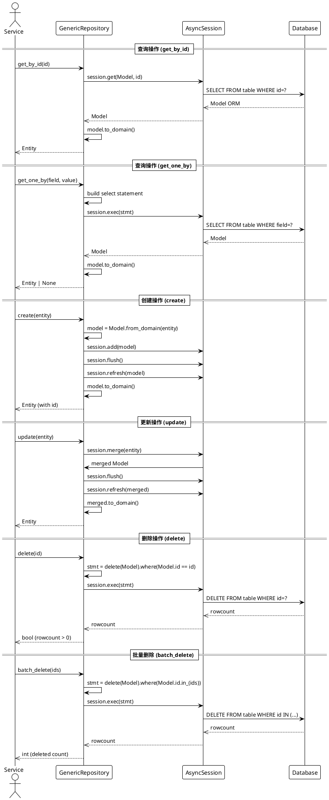

# Hello-FastApi 核心流程图与时序图

> 本文档使用 PlantUML 语法绘制，支持 VS Code / GitLab / GitHub 预览

---

## 1. 认证流程时序图

### 1.1 登录流程



### 1.2 Token 刷新流程



---

## 2. RBAC 权限校验时序图



---

## 3. 动态路由加载时序图



---

## 4. 请求处理全流程图

```plantuml
@startuml
!theme plain

|客户端请求| as A

if () then (CORS 检查)
    if () then (不通过)
        :[403 CORS 错误]
    else (通过)
        :[RequestLoggingMiddleware\n记录请求日志]
        
        if () then (需要认证?)
            :[直接进入路由处理]
        else (受保护接口)
            :[get_current_user_id\n解码 JWT Token]
            
            if () then (Token 有效?)
                if () then (在黑名单?)
                    :[401 Token 已注销]
                else (不在黑名单)
                    if () then (需要权限?)
                        :[require_permission\n缓存优先 + 单次 JOIN 查询]
                        if () then (权限足够?)
                            :[权限校验通过]
                        else (权限不足)
                            :[403 Forbidden]
                        end
                    end
                end
            else (无效/过期)
                :[401 Unauthorized]
            end
        end
    end
end

: [调用应用服务]

if () then (操作成功)
    :[get_db 自动 commit]
    :[统一响应 success_response]
else (操作失败)
    :[get_db 自动 rollback]
    
    if () then (AppError)
        :[ExceptionHandler\n返回业务错误]
    else if () then (ValidationError)
        :[422 参数校验错误]
    else
        :[500 内部错误]
    end
end

:[返回响应给客户端]

note right
非 GET 请求: 写入操作审计日志\nsys_operation_logs
end note

@enduml
```

---

## 5. 数据库 ER 关系图



---

## 6. 依赖注入装配流程图

```plantuml
@startuml
!theme plain

|HTTP 请求| as REQ

box "Depends 链"
    participant "get_db" as GET_DB
    participant "get_xxx_service" as GET_SVC
end box

box "服务实例"
    participant "XxxService" as SVC
end box

box "权限校验"
    participant "require_permission" as PERM
    participant "get_current_user_id" as CURR_USER
    participant "CacheService" as CACHE
    participant "MenuRepository" as MENU_REPO
end box

REQ -> GET_DB: Depends get_db
GET_DB -> SESSION: AsyncSession\nauto commit/rollback

REQ -> GET_SVC: Depends get_xxx_service

GET_SVC -> TOKEN_SVC: Depends get_token_service\nnew TokenService settings
GET_SVC -> PWD_SVC: Depends get_password_service\nPasswordService 静态
GET_SVC -> CACHE_SVC: Depends get_cache_service\nCacheService redis
GET_SVC -> REPO: Depends get_xxx_repository\nnew XxxRepository session

REPO -> SESSION

GET_SVC -> SVC: 注入 session + repos + domain_services + cache

REQ -> PERM: Depends require_permission

PERM -> CURR_USER: Depends get_current_user_id\nTokenService.decode + 黑名单检查
CURR_USER -> CACHE: 优先缓存查询
CURR_USER -> MENU_REPO: get_user_all_menus\n单次 JOIN 查询

CACHE -> SESSION
MENU_REPO -> SESSION

SVC -> EXEC: 执行业务逻辑
PERM -> EXEC

@enduml
```

---

## 7. 异常处理流程图

```plantuml
@startuml
!theme plain

|请求处理| as REQ

if () then (结果)
    :[统一响应 success_response\ncode: 0]
else if () then (AppError 子类)
    if () then (NotFoundError)
        :[404 code: 404]
    else if () then (ConflictError)
        :[409 code: 409]
    else if () then (UnauthorizedError)
        :[401 code: 401]
    else if () then (ForbiddenError)
        :[403 code: 403]
    else if () then (ValidationError)
        :[422 code: 422]
    else if () then (RateLimitError)
        :[429 code: 429]
    else
        :[400 code: 400]
    end
else if () then (RequestValidationError)
    :[422 参数校验失败\ndetail: 字段错误列表]
else
    :[500 内部服务器错误\ncode: 500]
end

: [统一响应格式\ncode + message + data]

@enduml
```

---

## 8. 仓储层 CRUD 时序图

