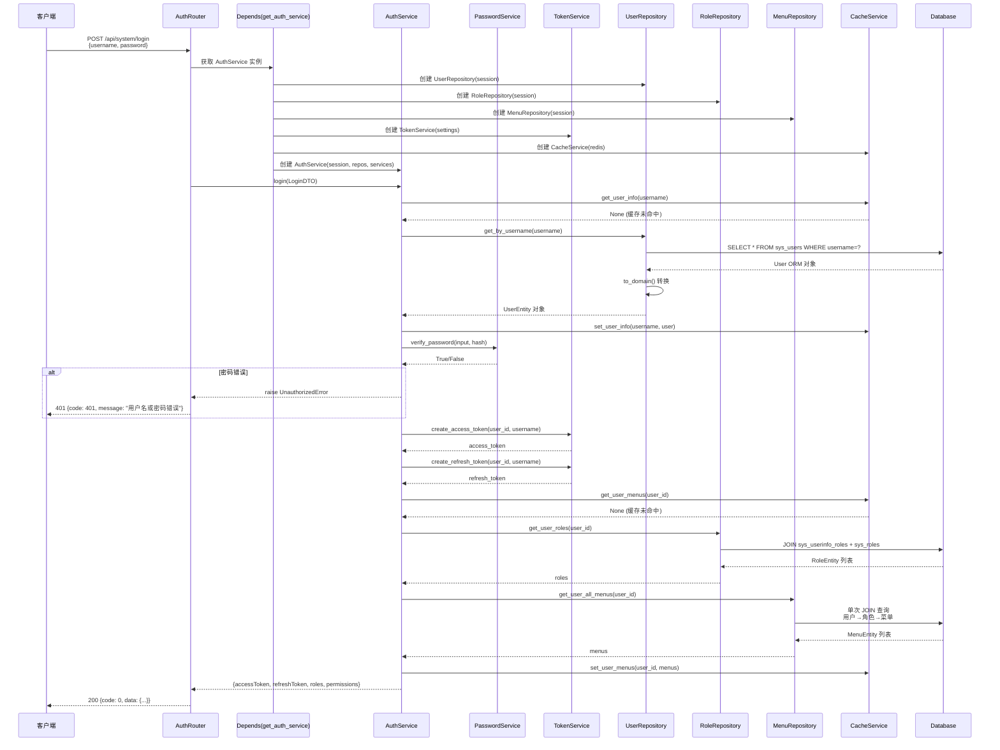
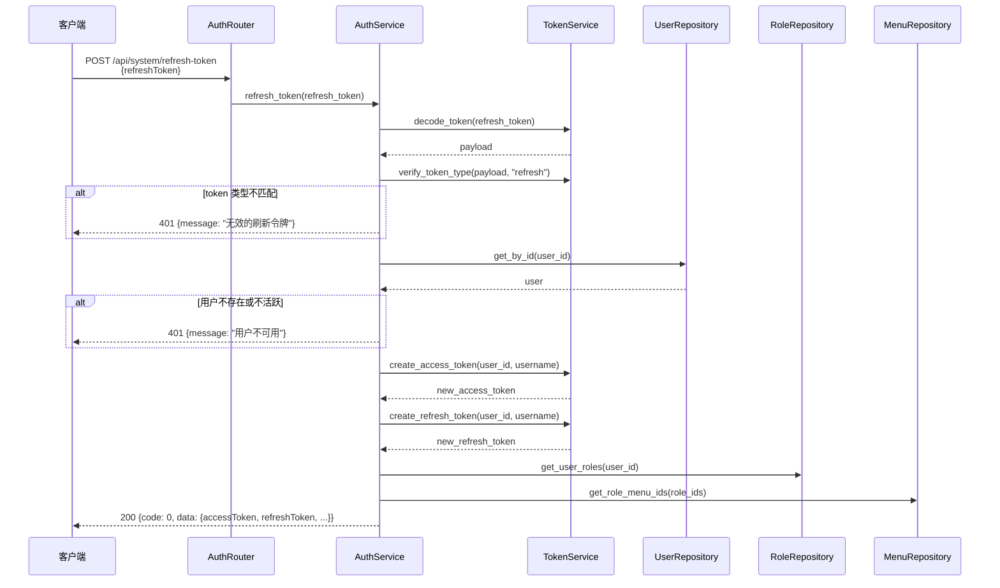
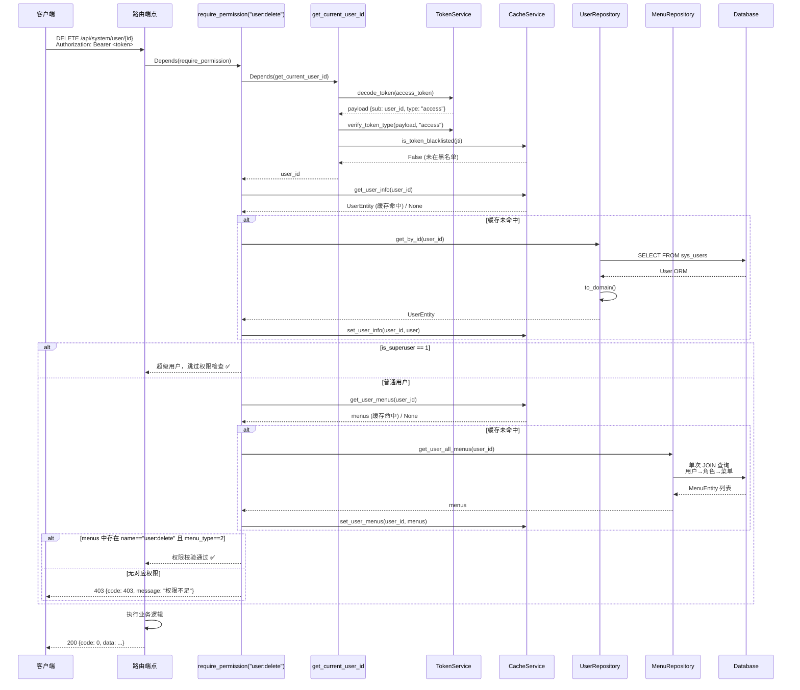
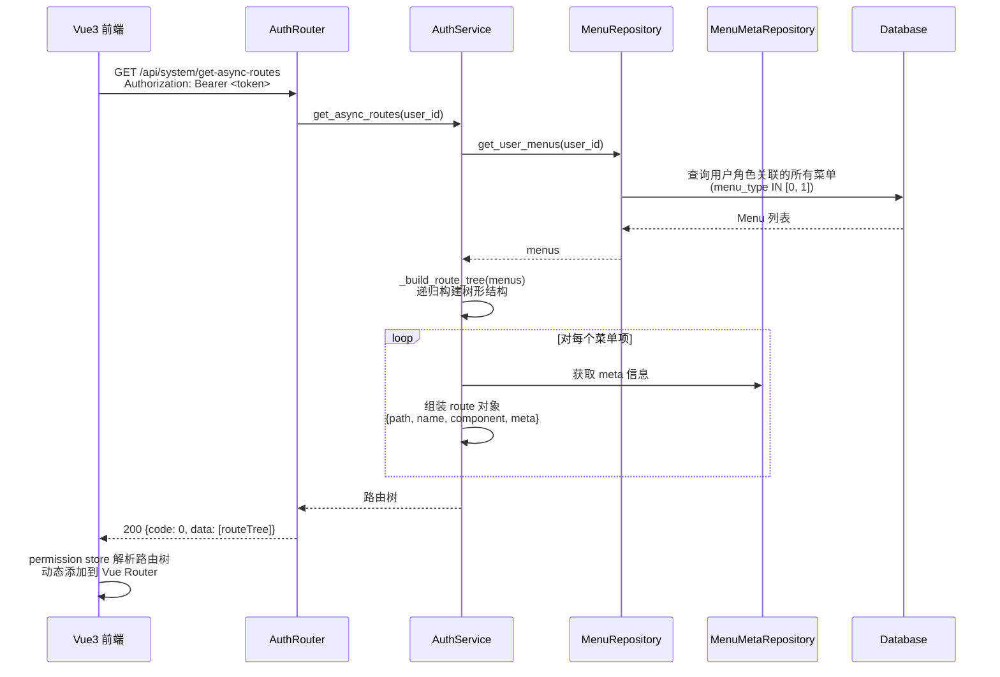
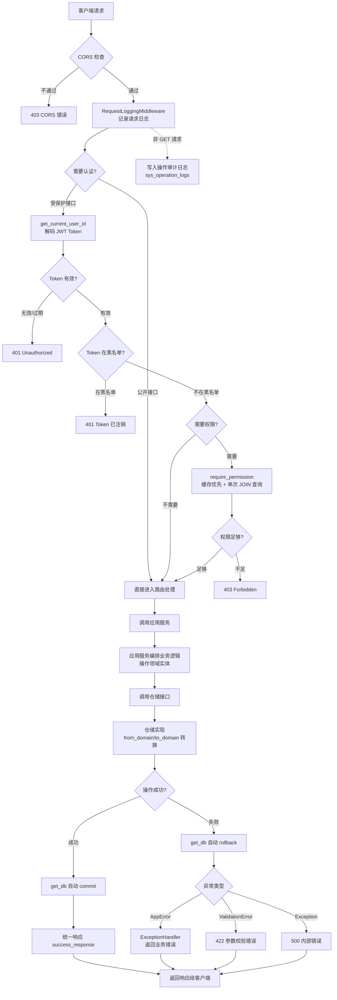
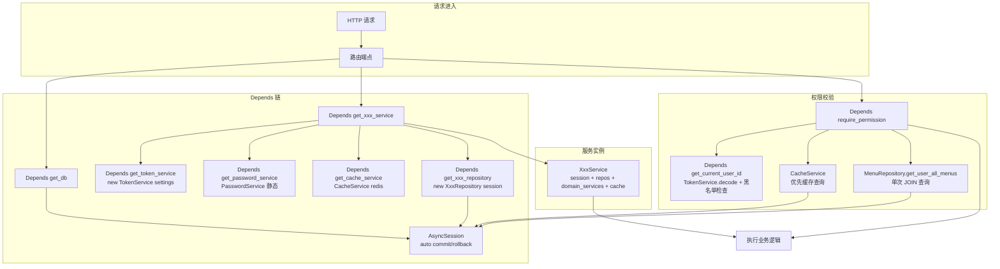
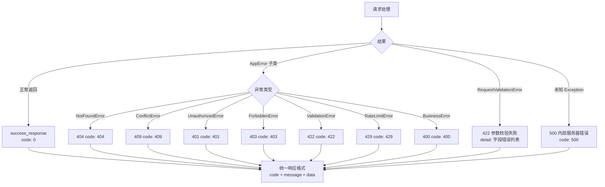

# Hello-FastApi 核心流程图与时序图

> 本文档使用 Mermaid 语法绘制，支持 GitHub / VS Code 预览

---

## 1. 认证流程时序图

### 1.1 登录流程

### 1.2 Token 刷新流程

---

## 2. RBAC 权限校验时序图

---

## 3. 动态路由加载时序图

---

## 4. 请求处理全流程图

---

## 5. 数据库 ER 关系图

```mermaid
erDiagram
    sys_users {
        varchar id PK "32位UUID"
        varchar username UK "用户名"
        varchar password "bcrypt哈希"
        varchar email UK "邮箱"
        int is_superuser "0/1"
        int is_active "0/1"
        int is_staff "0/1"
        varchar dept_id FK "部门ID"
        datetime created_time "创建时间"
        datetime updated_time "更新时间"
    }

    sys_roles {
        varchar id PK
        varchar name UK "角色名"
        varchar code UK "角色编码"
        int is_active "0/1"
        varchar description "描述"
        datetime created_time
        datetime updated_time
    }

    sys_menus {
        varchar id PK
        int menu_type "0目录/1菜单/2权限"
        varchar name UK "权限标识"
        varchar path "路由路径"
        varchar component "前端组件"
        varchar parent_id FK "父菜单ID"
        varchar meta_id FK "元数据ID"
        int sort "排序"
        datetime created_time
        datetime updated_time
    }

    sys_menumeta {
        varchar id PK
        varchar title "显示标题"
        varchar icon "图标"
        int is_show_menu "0/1"
        int is_keepalive "0/1"
        varchar frame_url "内嵌URL"
    }

    sys_departments {
        varchar id PK
        varchar name "部门名称"
        varchar code UK "部门编码"
        varchar parent_id FK "父部门ID"
        int sort "排序"
    }

    sys_userinfo_roles {
        varchar id PK
        varchar userinfo_id FK "用户ID"
        varchar userrole_id FK "角色ID"
    }

    sys_userrole_menu {
        varchar id PK
        varchar userrole_id FK "角色ID"
        varchar menu_id FK "菜单ID"
    }

    sys_login_logs {
        varchar id PK
        varchar username "登录用户名"
        varchar ip "IP地址"
        varchar status "登录状态"
        datetime created_time
    }

    sys_operation_logs {
        varchar id PK
        varchar user_id "操作用户ID"
        varchar method "HTTP方法"
        varchar path "请求路径"
        text params "请求参数"
        datetime created_time
    }

    sys_dictionary {
        varchar id PK
        varchar code "字典编码"
        varchar name "字典名称"
        text value "字典值"
    }

    sys_ip_rules {
        varchar id PK
        varchar ip "IP地址/网段"
        int rule_type "0黑名单/1白名单"
        int is_active "0/1"
    }

    sys_system_config {
        varchar id PK
        varchar config_key UK "配置键"
        text config_value "配置值"
        varchar description "描述"
    }

    sys_users ||--o{ sys_userinfo_roles : "用户-角色关联"
    sys_roles ||--o{ sys_userinfo_roles : "角色被分配"
    sys_roles ||--o{ sys_userrole_menu : "角色-菜单关联"
    sys_menus ||--o{ sys_userrole_menu : "菜单被分配"
    sys_menus ||--o| sys_menus : "父子菜单"
    sys_menus ||--o| sys_menumeta : "菜单元数据"
    sys_departments ||--o{ sys_departments : "父子部门"
    sys_users }o--o| sys_departments : "所属部门"
```

---

## 6. 依赖注入装配流程图

---

## 7. 异常处理流程图

