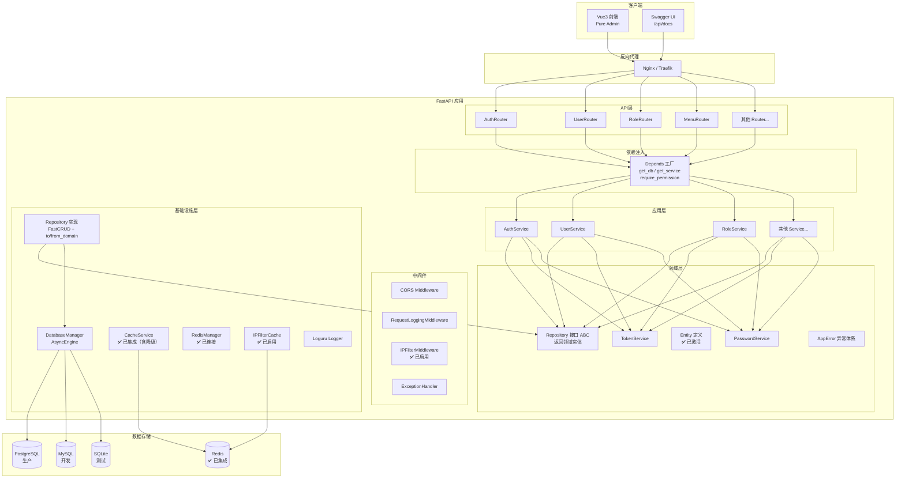
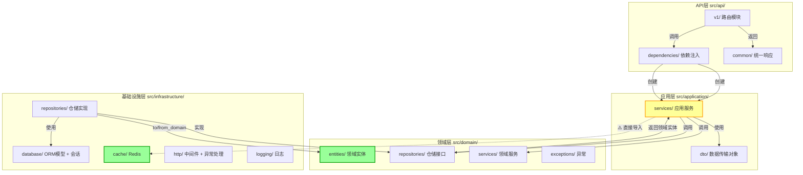
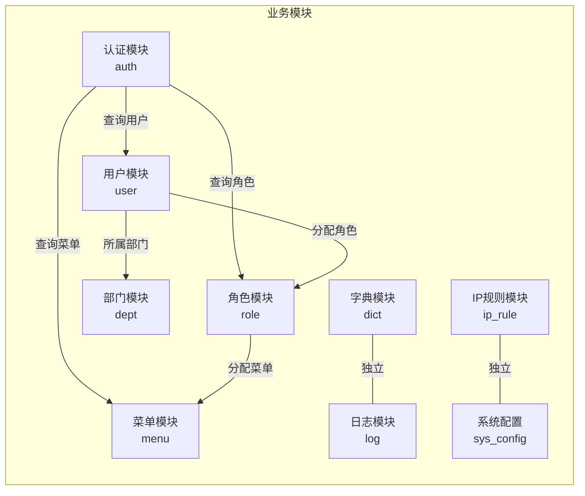
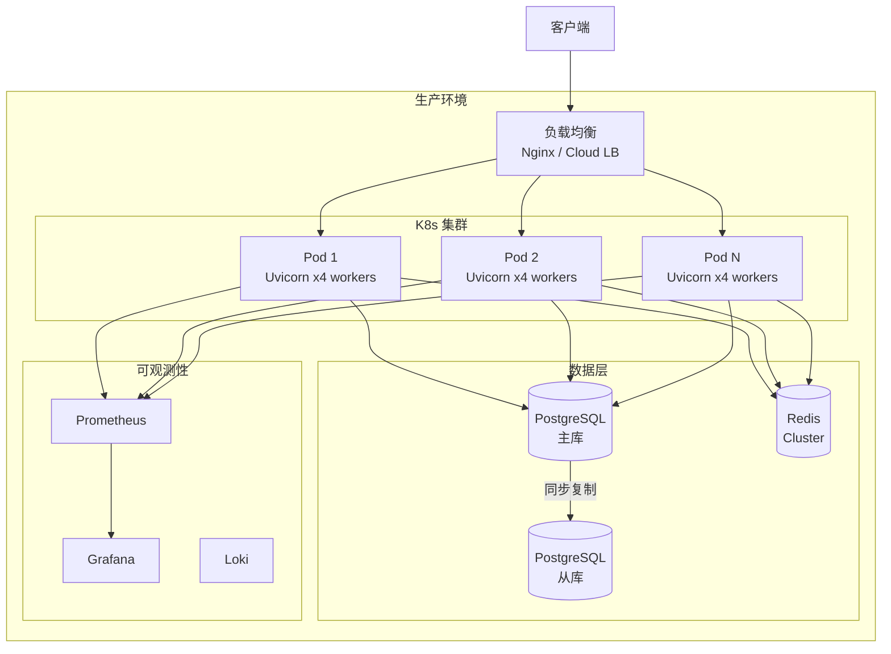

# Hello-FastApi 系统架构图

> 本文档使用 Mermaid 语法绘制，支持 GitHub / VS Code 预览

---

## 1. 系统整体架构图

---

## 2. DDD 分层依赖关系图

> 🟢 绿色标记表示"已激活/已集成"的组件 | 🟡 黄色标记表示"存在分层约束违规"的组件

---

## 3. 模块依赖矩阵图

---

## 4. 部署架构图

> ⚠️ 当前项目仅实现了单 Pod 部署，Redis 已集成，数据库和可观测性需要补充
