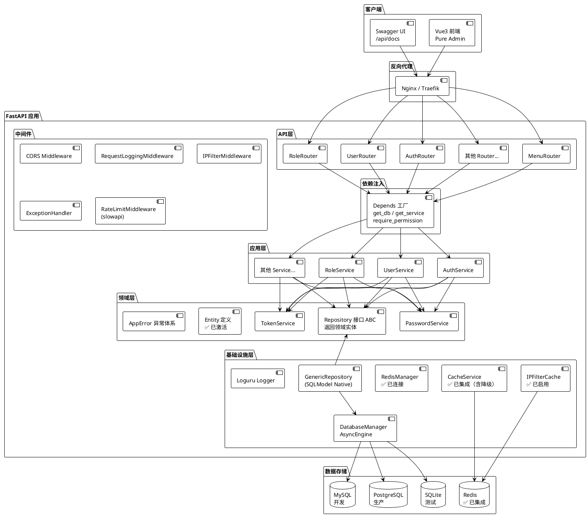
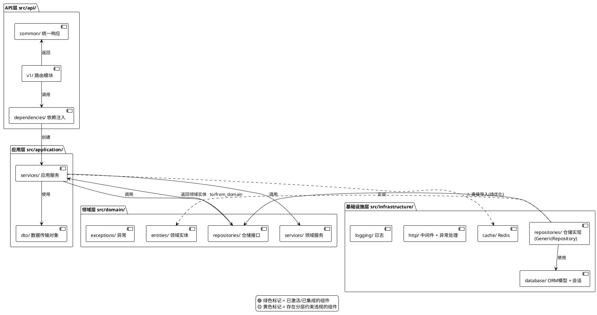
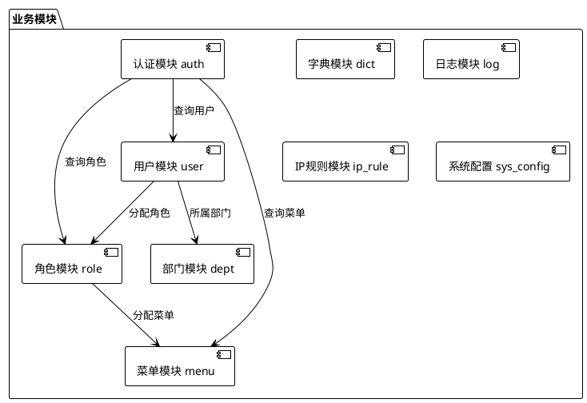
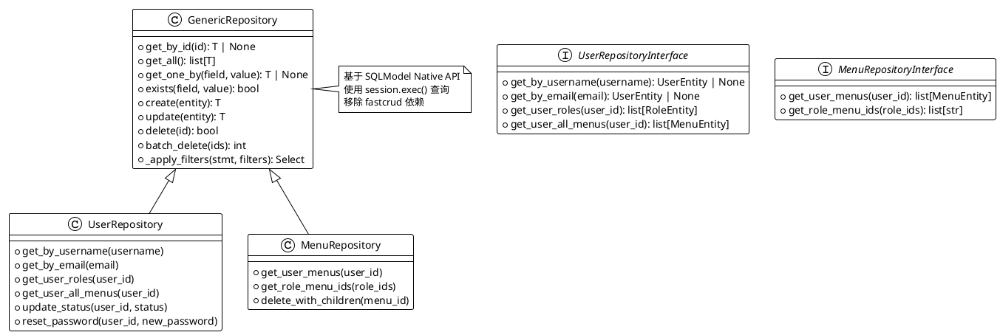
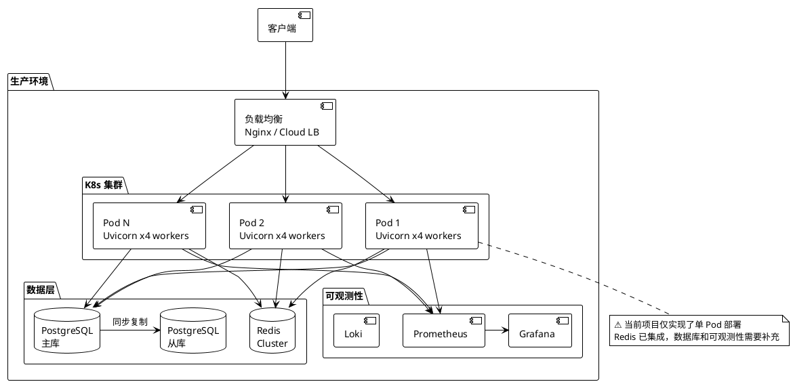

# Hello-FastApi 系统架构图

> 本文档使用 PlantUML 语法绘制，支持 VS Code / GitLab / GitHub 预览

---

## 1. 系统整体架构图

---

## 2. DDD 分层依赖关系图

---

## 3. 模块依赖矩阵图

---

## 4. 仓储层架构图（重构后）

---

## 5. 部署架构图

---

## 6. 关键技术栈

| 层级 | 技术选型 | 说明 |
|------|----------|------|
| Web 框架 | FastAPI 0.115+ | ASGI + Pydantic v2 |
| ORM | SQLModel 0.0.22+ | SQLAlchemy 2.0 + Pydantic |
| 仓储层 | GenericRepository (自研) | SQLModel Native API，移除 fastcrud |
| 数据库 | PostgreSQL (生产) / SQLite (测试) | AsyncDriver |
| 缓存 | Redis 5.0+ | 含降级策略 |
| 认证 | JWT (python-jose) + bcrypt | Token + 密码哈希 |
| API 风格 | classy-fastapi | 类装饰器路由 |
| 限流 | slowapi + limits | 固定窗口限流 |
| 日志 | loguru | 结构化日志 |
| 文档 | Swagger UI + ReDoc | /api/docs |

> 🟢 已移除 `fastcrud` 依赖，改用基于 SQLModel Native API 的 `GenericRepository`