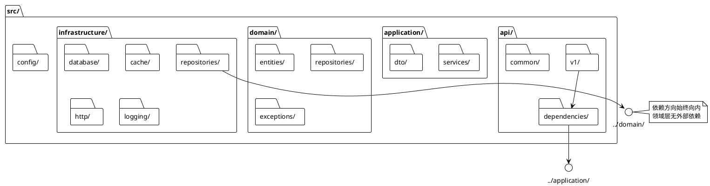
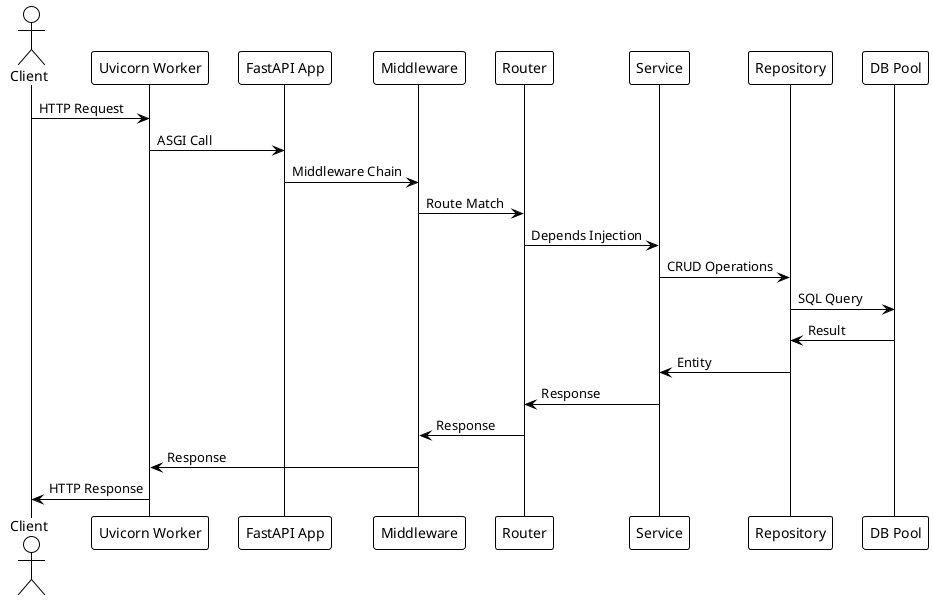
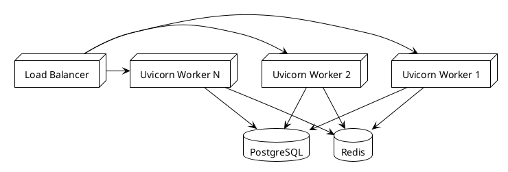
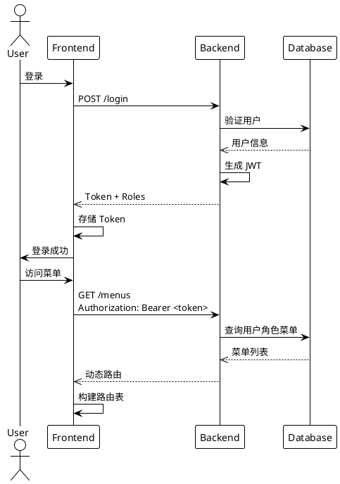

# FastAPI + DDD 分层架构与调用约束

本文档定义了基于 FastAPI 的简化版 DDD（领域驱动设计）项目的分层结构、各层职责、依赖关系及调用约束。遵循此规范可保证代码清晰、可维护、易于测试。

---

## 0. 4+1 架构视图

> 4+1 视图从不同角度描述系统架构，满足开发、部署、性能、安全等多方面需求。

### 逻辑视图 (Logical View)
```plantuml
@startuml
!theme plain

package "接口层 (API)" {
    component "路由 (Router)" as ROUTE
    component "依赖注入 (Dependencies)" as DI
    component "统一响应 (Response)" as RESP
}

package "应用层 (Application)" {
    component "应用服务 (Service)" as APP
    component "DTO" as DTO
}

package "领域层 (Domain)" {
    component "实体 (Entity)" as ENT
    component "仓储接口 (Repository Interface)" as REPO_IF
    component "领域服务 (Domain Service)" as DOM_SVC
    component "异常 (Exception)" as EXC
}

package "基础设施层 (Infrastructure)" {
    component "仓储实现 (Repository Impl)" as REPO_IMPL
    component "数据库 (Database)" as DB
    component "缓存 (Cache)" as CACHE
    component "HTTP 中间件" as MIDDLEWARE
}

ROUTE -> DI -> APP -> DTO
APP -> REPO_IF
APP -> DOM_SVC
REPO_IMPL -> REPO_IF
REPO_IMPL -> DB

@enduml
```

### 开发视图 (Development View)


### 进程视图 (Process View)


### 物理视图 (Physical View)


### 场景视图 (Scenario)


---

## 1. 分层架构概览

项目采用经典的四层架构，自上而下依赖：

```
┌─────────────────────────────────────────────────┐
│                 接口层 (Interfaces)              │
│   REST API、Pydantic Schemas、路由、依赖注入    │
└─────────────────────────────────────────────────┘
                      │ 调用
                      ▼
┌─────────────────────────────────────────────────┐
│                应用层 (Application)              │
│   应用服务、DTO、用例编排、事务边界控制          │
└─────────────────────────────────────────────────┘
                      │ 调用
                      ▼
┌─────────────────────────────────────────────────┐
│                 领域层 (Domain)                  │
│   实体、值对象、聚合根、领域服务、仓储接口       │
└─────────────────────────────────────────────────┘
                      ▲ 实现
                      │
┌─────────────────────────────────────────────────┐
│              基础设施层 (Infrastructure)         │
│   仓储实现、ORM模型、外部服务、配置、会话管理    │
└─────────────────────────────────────────────────┘
```

**核心原则**：依赖方向始终向内，领域层不依赖任何外层，基础设施层实现领域层定义的抽象接口。

---

## 2. 各层职责详解

### 2.1 接口层 (Interfaces)
- **职责**：处理 HTTP 请求/响应、参数校验、认证授权、将请求数据转换为应用层 DTO、调用应用服务并返回响应。
- **禁止**：包含业务逻辑、直接操作数据库、直接调用基础设施层实现。
- **组件**：
  - `routes/`：FastAPI 路由定义，使用 `Depends` 注入依赖。
  - `schemas/`：Pydantic 模型，用于请求/响应验证与序列化。
  - `dependencies/`：认证、数据库会话等公共依赖。

### 2.2 应用层 (Application)
- **职责**：编排用例流程，包括：获取输入（DTO）、调用领域对象/领域服务、协调事务（提交/回滚）、调用仓储接口、发布领域事件、协调缓存策略。
- **禁止**：包含核心业务规则（这些规则应下沉到领域层）；直接导入基础设施层具体实现（违反 DIP）。
- **组件**：
  - `dto/`：数据传输对象，用于应用层与接口层之间的数据传递。
  - `services/`：应用服务，每个用例对应一个方法，无状态，依赖领域层抽象。

> ⚠️ **当前违规案例**（待修复）：
> - `IPRuleService` 直接导入 `from src.infrastructure.http.ip_filter_cache import get_ip_filter_cache`
> - `MenuService` / `UserService` 直接导入 `from src.infrastructure.cache.cache_service import CacheService`
>
> **正确做法**：在领域层定义缓存接口（如 `CachePort`），基础设施层实现，应用层通过抽象调用。

### 2.3 领域层 (Domain)
- **职责**：实现核心业务逻辑，保证业务规则的不变性。
- **禁止**：依赖基础设施层（如 ORM、外部 API）、依赖应用层、依赖接口层。
- **组件**：
  - `aggregates/`：聚合根，是聚合的入口，保证聚合内数据一致性。
  - `entities/`：实体，具有唯一标识和生命周期。
  - `value_objects/`：值对象，不可变，通过属性值定义相等性。
  - `repositories/`：仓储接口（抽象），定义聚合的持久化操作。
  - `services/`：领域服务，处理跨多个实体/聚合的业务逻辑。
  - `events/`：领域事件（可选），表示业务发生的重要事实。

### 2.4 基础设施层 (Infrastructure)
- **职责**：实现领域层定义的抽象接口，提供技术支撑（数据库、缓存、消息队列、外部 API 调用等）。
- **依赖**：可以依赖领域层（实现接口），也可以依赖第三方库（如 SQLAlchemy、Redis 客户端）。
- **组件**：
  - `database/`：数据库相关（ORM 模型、会话工厂、迁移脚本）。
  - `repositories/`：仓储接口的具体实现（含 `to_domain()` / `from_domain()` 转换），基于 **GenericRepository** (SQLModel Native API)。
  - `services/`：领域服务的具体实现（如外部折扣服务）。
  - `cache/`：缓存服务（`CacheService` — Token 黑名单、用户信息缓存、权限缓存，含 Redis 降级策略）。
  - `http/`：HTTP 相关（`IPFilterMiddleware`、`IPFilterCache`、异常处理中间件）。
  - `config/`：配置管理（环境变量、配置类）。

> **当前实现亮点**：
> - **GenericRepository**: 基于 SQLModel Native API，使用 `session.exec()` 查询，移除 fastcrud 依赖
> - `CacheService` 封装 Redis 操作，支持 Redis 不可用时自动降级为无缓存模式
> - 仓储实现统一使用 `to_domain()` / `from_domain()` 完成 ORM↔Entity 转换
> - `IPFilterCache` 实现规则缓存和定时自动刷新

---

## 3. 依赖关系与调用约束

### 3.1 依赖方向（关键约束）
| 调用方               | 可调用/依赖                                                                                       |
| -------------------- | ------------------------------------------------------------------------------------------------- |
| **接口层**           | → 应用层、基础设施层（仅通过依赖注入的抽象）、接口层内部组件                                       |
| **应用层**           | → 领域层、基础设施层（仅通过抽象接口，如仓储接口）、应用层内部组件                                 |
| **领域层**           | → 领域层内部（实体/值对象/领域服务/仓储接口），不可依赖任何外层                                     |
| **基础设施层**       | → 领域层（实现其抽象）、基础设施层内部组件、第三方库                                                 |

### 3.2 详细调用规则
#### ✅ 允许的调用
- **接口层** 调用 **应用服务**（通过依赖注入）。
- **接口层** 使用 Pydantic Schema 进行校验，并转换为 **应用层 DTO**。
- **应用服务** 调用 **领域层** 的实体方法、聚合根方法、领域服务、仓储接口。
- **应用服务** 控制事务边界（如 `session.commit()`）。
- **领域服务** 调用实体/值对象/聚合根方法，调用其他领域服务，调用仓储接口（仅限读操作或必要场景）。
- **基础设施层** 实现领域层定义的仓储接口、领域服务接口。
- **基础设施层** 提供数据库会话工厂、外部客户端等，供应用层注入。

#### ❌ 禁止的调用
- **领域层** 直接导入基础设施层的任何具体实现（如 SQLAlchemy Model）。
- **领域层** 依赖应用层或接口层。
- **应用层** 包含业务规则判断（如 `if order.total > 100: ...`，这些应放在领域层）。
- **应用层** 直接导入基础设施层具体实现（如 `from src.infrastructure.cache.cache_service import CacheService`）。应通过领域层定义抽象接口，依赖注入传入。
- **接口层** 直接操作数据库或调用基础设施层的具体实现（应通过应用服务间接完成）。
- **实体/值对象** 直接调用仓储或外部服务（可通过领域服务封装）。
- **实体** 访问自身私有属性（如 `entity._meta = value`）。应通过构造函数或 setter 方法。

> ⚠️ **当前已知违规**（P1 待修复）：
> | 文件 | 违规导入 | 正确做法 |
> |------|---------|---------|
> | `IPRuleService` | `from src.infrastructure.http.ip_filter_cache import get_ip_filter_cache` | 领域层定义 `IPFilterPort`，基础设施层实现 |
> | `MenuService` | `from src.infrastructure.cache.cache_service import CacheService` | 领域层定义 `CachePort`，基础设施层实现 |
> | `UserService` | `from src.infrastructure.cache.cache_service import CacheService` | 同上 |
> | `MenuService._dict_to_entity` | `menu._meta = meta_entity` | 使用构造函数或 `with_meta()` 方法 |

---

## 4. 代码示例

### 4.1 领域层：聚合根与仓储接口
```python
# src/domain/aggregates/order.py
from dataclasses import dataclass
from src.domain.value_objects.money import Money

@dataclass
class Order:
    id: int
    total: Money
    status: str

    def apply_discount(self, discount: Money):
        self.total = self.total - discount
        # 业务规则：订单金额不能小于0
        if self.total.amount < 0:
            raise ValueError("Discount exceeds order total")

    def complete(self):
        self.status = "COMPLETED"
```

```python
# src/domain/repositories/order_repository.py
from abc import ABC, abstractmethod
from src.domain.aggregates.order import Order

class OrderRepository(ABC):
    @abstractmethod
    async def save(self, order: Order) -> None:
        pass

    @abstractmethod
    async def get_by_id(self, order_id: int) -> Order | None:
        pass
```

### 4.2 应用层：应用服务与 DTO
```python
# src/application/dto/order_dto.py
from dataclasses import dataclass

@dataclass
class CreateOrderDTO:
    user_id: int
    items: list[dict]
    user_level: str
```

```python
# src/application/services/order_app_service.py
from src.domain.repositories.order_repository import OrderRepository
from src.domain.services.discount_service import DiscountService
from src.domain.aggregates.order import Order
from src.application.dto.order_dto import CreateOrderDTO

class OrderAppService:
    def __init__(self, order_repo: OrderRepository, discount_svc: DiscountService):
        self.order_repo = order_repo
        self.discount_svc = discount_svc

    async def create_order(self, dto: CreateOrderDTO) -> Order:
        # 1. 创建聚合根（领域层）
        order = Order.create(dto.user_id, dto.items)

        # 2. 调用领域服务计算折扣
        discount = self.discount_svc.calculate_discount(order, dto.user_level)
        order.apply_discount(discount)

        # 3. 持久化（通过仓储接口）
        await self.order_repo.save(order)

        # 4. 提交事务（由调用方或装饰器控制）
        return order
```

### 4.3 基础设施层：仓储实现
```python
# src/infrastructure/repositories/sqlalchemy_order_repository.py
from sqlalchemy.ext.asyncio import AsyncSession
from src.domain.repositories.order_repository import OrderRepository
from src.domain.aggregates.order import Order
from src.infrastructure.db.models.order_model import OrderModel

class SQLAlchemyOrderRepository(OrderRepository):
    def __init__(self, session: AsyncSession):
        self.session = session

    async def save(self, order: Order) -> None:
        model = OrderModel.from_domain(order)  # 转换方法
        self.session.add(model)
        await self.session.flush()  # 不提交，由应用层控制事务

    async def get_by_id(self, order_id: int) -> Order | None:
        model = await self.session.get(OrderModel, order_id)
        return model.to_domain() if model else None
```

### 4.4 接口层：路由与依赖注入
```python
# src/interfaces/api/routes/order_router.py
from fastapi import APIRouter, Depends, HTTPException
from src.interfaces.schemas.order_schema import CreateOrderRequest, OrderResponse
from src.application.services.order_app_service import OrderAppService
from src.dependencies import get_order_app_service

router = APIRouter()

@router.post("/orders", response_model=OrderResponse)
async def create_order(
    request: CreateOrderRequest,
    app_service: OrderAppService = Depends(get_order_app_service)
):
    try:
        order = await app_service.create_order(request.to_dto())
        return OrderResponse.from_domain(order)
    except ValueError as e:
        raise HTTPException(status_code=400, detail=str(e))
```

### 4.5 依赖注入（全局）
```python
# src/dependencies.py
from fastapi import Depends
from sqlalchemy.ext.asyncio import AsyncSession
from src.infrastructure.db.session import get_async_session
from src.infrastructure.repositories.sqlalchemy_order_repository import SQLAlchemyOrderRepository
from src.infrastructure.services.external_discount_service import ExternalDiscountService
from src.application.services.order_app_service import OrderAppService
from src.domain.repositories.order_repository import OrderRepository
from src.domain.services.discount_service import DiscountService

async def get_order_repository(
    session: AsyncSession = Depends(get_async_session)
) -> OrderRepository:
    return SQLAlchemyOrderRepository(session)

def get_discount_service() -> DiscountService:
    # 可以是领域服务的具体实现（外部服务实现）
    return ExternalDiscountService()

def get_order_app_service(
    order_repo: OrderRepository = Depends(get_order_repository),
    discount_svc: DiscountService = Depends(get_discount_service)
) -> OrderAppService:
    return OrderAppService(order_repo, discount_svc)
```

---

## 5. 关键规则总结

| 规则编号 | 说明                                                                                     |
| -------- | ---------------------------------------------------------------------------------------- |
| R1       | **依赖倒置**：领域层定义抽象接口（如仓储），基础设施层实现这些接口，应用层通过抽象调用。 |
| R2       | **领域层无外部依赖**：领域层代码不能导入 `infrastructure`、`application`、`interfaces`。 |
| R3       | **实体无状态行为**：实体方法仅操作自身数据，不调用仓储或外部服务。                       |
| R4       | **聚合根作为入口**：聚合内的所有修改必须通过聚合根方法进行，保证一致性。                 |
| R5       | **事务在应用层控制**：应用服务负责开启/提交/回滚事务，领域层不处理事务。                 |
| R6       | **接口层只做转换**：接口层不包含业务逻辑，仅做请求校验、DTO 转换、错误处理。            |
| R7       | **领域服务无状态**：领域服务的方法不应依赖实例变量（除依赖注入的抽象）。                 |
| R8       | **仓储接口只对聚合根**：每个聚合根对应一个仓储接口，不直接操作实体。                     |
| R9       | **缓存通过抽象访问**：应用层通过领域层定义的缓存抽象接口访问缓存，不直接导入基础设施层缓存实现。 |
| R10      | **实体行为方法优先**：状态变更应优先通过实体行为方法（如 `activate()`）而非直接修改字段（如 `update_info(is_active=1)`）。 |
| R11      | **仓储转换一致**：仓储实现统一使用 `to_domain()` / `from_domain()` 完成 ORM↔Entity 转换，确保领域层与基础设施层隔离。 |

---

## 6. 测试策略

- **领域层**：纯单元测试，不依赖数据库、网络等外部资源。使用 pytest 直接测试实体、值对象、领域服务。
- **应用层**：单元测试，模拟仓储和领域服务，验证用例编排逻辑。
- **基础设施层**：集成测试，使用真实数据库（如测试数据库）验证仓储实现。
- **接口层**：端到端测试，通过 FastAPI TestClient 验证 API 行为。

---

## 7. 扩展性

该架构为扩展提供了良好基础：
- **CQRS**：可在应用层分离读写模型，命令与查询使用不同路径。
- **事件驱动**：在领域层定义事件，应用层发布事件，基础设施层实现事件处理器。
- **微服务拆分**：领域层保持不变，基础设施层可替换为远程调用客户端。

---

遵循以上约束，项目将具备清晰的分层、低耦合、高可测试性，易于团队协作和长期维护。

---

## 8. 缓存层约定

### 8.1 缓存架构

项目通过 `CacheService`（`infrastructure/cache/cache_service.py`）统一管理缓存，底层使用 Redis，支持降级策略。

```
┌─────────────────────────────────────────────────┐
│               应用层 (Application)                │
│  AuthService / MenuService / UserService          │
│  ⚠️ 当前直接导入 CacheService，应通过抽象接口     │
└─────────────────────────────────────────────────┘
                      │ 调用
                      ▼
┌─────────────────────────────────────────────────┐
│          领域层 (Domain) — 缺少缓存抽象           │
│  ⚠️ 待新增 CachePort 接口                         │
└─────────────────────────────────────────────────┘
                      ▲ 实现
                      │
┌─────────────────────────────────────────────────┐
│           基础设施层 (Infrastructure)             │
│  CacheService                                     │
│  ├── Token 黑名单 (token:blacklist:{jti})         │
│  ├── 用户信息缓存 (user:info:{user_id})           │
│  ├── 用户菜单缓存 (user:menus:{user_id})          │
│  └── 降级策略: Redis 不可用时自动降级为无缓存      │
│  IPFilterCache                                    │
│  └── IP 规则缓存 + 定时自动刷新                    │
└─────────────────────────────────────────────────┘
```

### 8.2 缓存使用规范

1. **缓存键命名**：`{模块}:{操作}:{标识}`，如 `token:blacklist:{jti}`、`user:info:{user_id}`
2. **TTL 设置**：Token 黑名单 TTL = token 剩余过期时间；业务缓存 TTL 由配置控制
3. **降级策略**：`CacheService` 内部捕获 Redis 连接异常，降级为无缓存模式，不影响业务逻辑
4. **缓存失效**：数据变更时主动清除缓存（如修改用户信息后清除 `user:info:{user_id}`）

### 8.3 待改进

- 在领域层定义 `CachePort` 抽象接口，应用层通过抽象调用缓存
- `IPFilterCache` 同样应通过抽象接口访问
- 考虑引入多级缓存策略（本地缓存 + Redis）